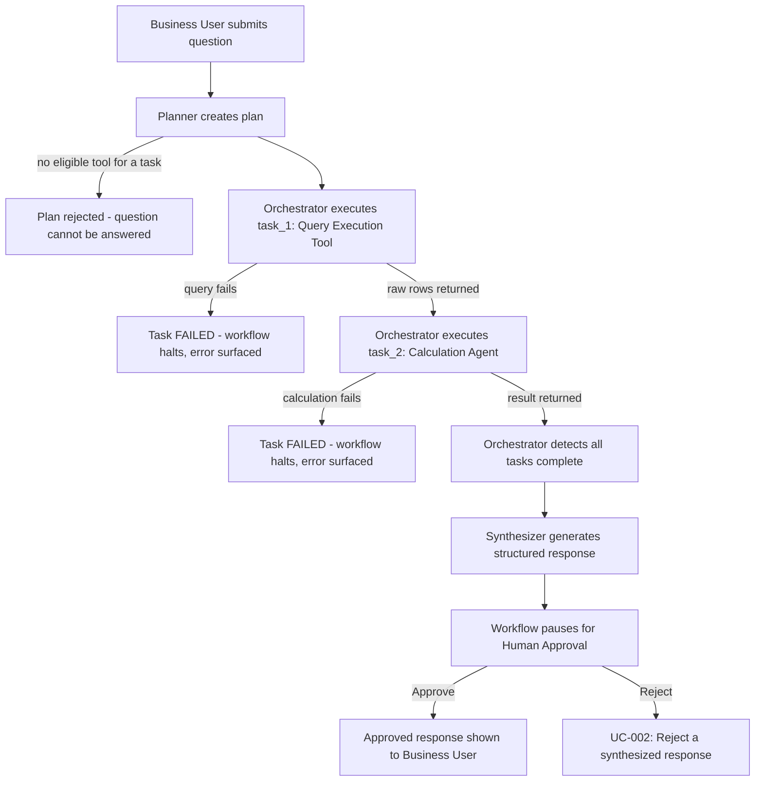
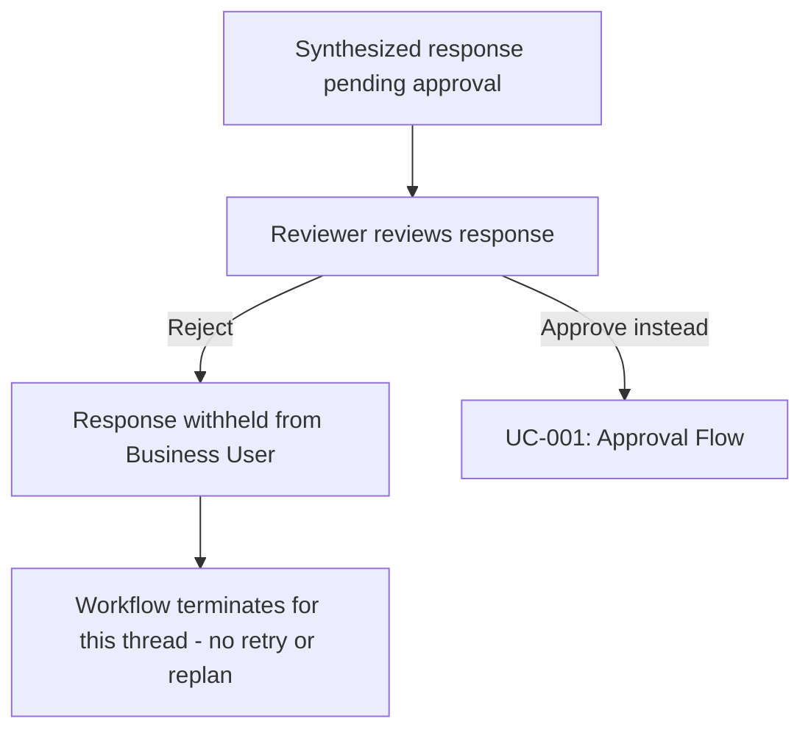
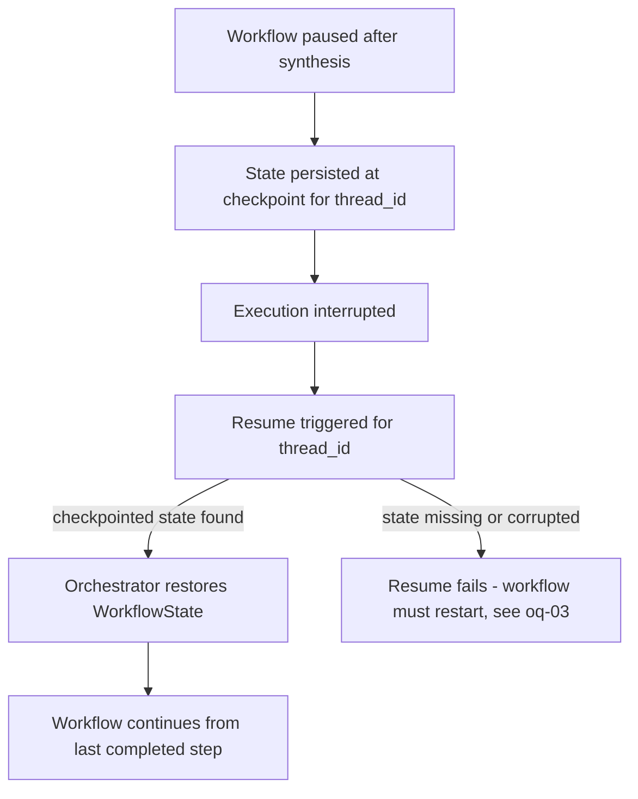
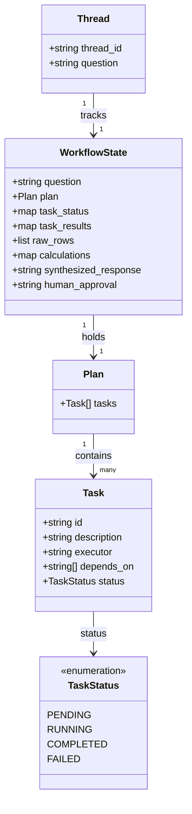

---
daksh:
  type: business-requirements
  subtype: null
  stage: "20"
  module: null
---

# Business Requirements

This [BRD](glossary#brd) turns the team's own research write-up —
[AI-Powered Data Analysis and Human-in-the-Loop Orchestration POC](AI_Data_Analysis_Orchestration_POC.md)
— into traceable [use cases](glossary#uc), [functional requirements](glossary#fr),
and [acceptance criteria](glossary#ac) for the LangGraph orchestration
[POC](glossary#poc). No prior `vision.md` or `client-context.md` exists for
this project (both are `not_started` in the manifest); this BRD is grounded
directly in the research doc and in a conversation with the requester,
standing in for both `[derived/observed · src:docs/AI_Data_Analysis_Orchestration_POC.md · 2026-09-07]`.
The audience is the delivery team building the POC and whoever signs off on
it before implementation starts.

<details><summary>Graph: What must be true — and measurable — for the business to accept this POC?</summary>

```items
---
id: brd-cognition
title: BRD cognition
default_open_depth: 1
default_color_by: kind
color_palette_source: .daksh/color-palette.json
width: 95vw
---
Goals:
  - goal-01 :: Natural-language data Q&A | kind: goal | summary: "Let users get sales/data answers in plain English instead of writing SQL." | spec: [§Goals](business-requirements.md#goals) | success_measure: "Representative business question answered end-to-end without the user writing SQL or performing manual calculation."
  - goal-02 :: Controlled human approval gate | kind: goal | summary: "Every AI-generated answer is reviewed by a human before being shown to the requester." | spec: [§Goals](business-requirements.md#goals) | success_measure: "No synthesized response reaches the user without an explicit Approve action."
  - goal-03 :: Resumable, observable orchestration | kind: goal | summary: "The workflow can pause, checkpoint, resume, and expose its internal decisions for demo and debugging." | spec: [§Goals](business-requirements.md#goals) | success_measure: "A paused workflow resumes from persisted state and every stage of its trace is inspectable."
Decisions:
  - decision-01 :: Separate LLM planner from code-based executor | kind: decision | summary: "The Planner Agent only plans; a non-LLM orchestration layer executes the plan, enforces dependencies, and manages state." | spec: [§Stakeholders](business-requirements.md#stakeholders) | alternatives: "A single agent that both plans and executes was considered and rejected — it makes dependency enforcement and state management implicit and hard to test deterministically." | reversal_trigger: "If a plan needs runtime re-planning mid-execution, the strict plan-then-execute split needs revisiting."
  - decision-02 :: Deterministic predefined queries over text-to-SQL | kind: decision | summary: "The Query Execution Tool ships 3-4 hand-defined SQL queries selected by the orchestrator, rather than generating SQL per question." | spec: [§Scope](business-requirements.md#scope) | alternatives: "Full text-to-SQL generation over arbitrary tables was considered and rejected for the POC — out of scope on safety and production-readiness grounds." | reversal_trigger: "If the in-scope question set outgrows what 3-4 predefined queries can answer, revisit toward parameterized or generated queries."
  - decision-03 :: Synthesizer is mandatory, not planner-optional | kind: decision | summary: "The Synthesizer always runs after planned tasks complete; the Planner cannot skip it." | spec: [§Stakeholders](business-requirements.md#stakeholders) | alternatives: "Letting the Planner decide whether synthesis is needed was considered and rejected — it would create a path where an unreviewed result reaches the user." | reversal_trigger: "None identified; revisit only if approval latency becomes unacceptable for trivial answers."
  - decision-04 :: Task-status enum is PENDING, RUNNING, COMPLETED, FAILED | kind: decision | summary: "Every task carries one of exactly four statuses; COMPLETED and FAILED are terminal, PENDING and RUNNING are not." | spec: [§Data Models](business-requirements.md#data-models) | alternatives: "A richer enum adding SKIPPED/CANCELLED was considered and deferred — the POC's task graph has no optional or cancellable tasks, so those states would sit unused." | reversal_trigger: "If a future plan introduces optional or cancellable tasks, extend the enum with SKIPPED and revisit this decision."
  - decision-05 :: Reject halts the workflow; no retry or replan | kind: decision | summary: "Reject is in scope and withholds the response, but the workflow simply stops for that thread — there is no automatic revision, replanning, or retry." | spec: [§Use Cases](business-requirements.md#use-cases) | alternatives: "A configured revision/retry path (Planner re-plans, or a fixed retry policy) was considered, per the source research's FR-013 wording — deferred as unneeded complexity for this POC; Reject terminates rather than looping." | reversal_trigger: "If the POC later needs automated recovery after a Reject (e.g. re-invoking the Planner with reviewer feedback), design a retry/replan policy then."
  - decision-06 :: Postgres is the checkpoint persistence backend | kind: decision | summary: "WorkflowState checkpoints are persisted to Postgres, keyed by thread_id, rather than kept in memory." | spec: [§Data Models](business-requirements.md#data-models) | alternatives: "An in-memory store was considered for demo simplicity but rejected — it would not survive a process restart, defeating the point of checkpoint/resume (goal-03, UC-003)." | reversal_trigger: "If a fully offline/no-DB demo environment is required, fall back to an embedded or file-based store and revisit."
  - decision-07 :: Reviewer vs. Business User differ by surface, not identity | kind: decision | summary: "No login is checked and no gate is added. A Business User is whoever reaches /chat (asks questions, sees only approved responses); a Reviewer is whoever reaches /review (sees pending responses, can Approve/Reject). The two roles are separated structurally by which UI/endpoint exposes which action, nothing more." | spec: [§Stakeholders](business-requirements.md#stakeholders) | alternatives: "Real authentication and role-based authorization were considered, per the original framing of oq-04 — rejected as out of scope (constraint-03); surface separation with no additional gate is the POC-appropriate substitute." | reversal_trigger: "If this moves beyond a POC to a real multi-user deployment, replace surface separation with real authentication and role-based authorization."
  - decision-08 :: First review response wins; later ones are no-ops | kind: decision | summary: "Whichever Approve/Reject request reaches the resume endpoint first for a given thread_id is final. The graph is no longer paused once it resumes, so a later request for the same thread has nothing left to act on." | spec: [§Use Cases](business-requirements.md#use-cases) | alternatives: "An explicit hard-conflict response (reject the second request with an 'already decided' error) was considered — deferred; the graph's own state transition already prevents a second resume from having any effect, so no extra conflict-detection code is needed for the POC." | reversal_trigger: "If reviewers report confusion from a silent second request, add an explicit 'already decided' response instead of a silent no-op."
Milestones:
  - milestone-01 :: Planner-to-Orchestrator core loop works | kind: milestone | summary: "Planner produces a valid dependent-task plan and the orchestrator executes task_1 then task_2 in order." | spec: [§Use Cases](business-requirements.md#use-cases) | due: "TBD - internal POC target" | definition_of_done: "A representative question produces a structured plan and the orchestrator executes it respecting the declared dependency."
  - milestone-02 :: Human-in-the-loop interrupt/resume demonstrated | kind: milestone | summary: "Workflow pauses after synthesis, persists state, and resumes correctly on Approve; on Reject it halts cleanly instead." | spec: [§Use Cases](business-requirements.md#use-cases) | due: "TBD - internal POC target" | definition_of_done: "A paused workflow is resumed from checkpointed state on Approve, and on Reject the workflow terminates for that thread with no retry (decision-05) — both paths are exercised."
  - milestone-03 :: Full end-to-end demo with observable trace | kind: milestone | summary: "The complete reference flow runs live with the orchestration trace visible." | spec: [§Use Cases](business-requirements.md#use-cases) | due: "TBD - internal POC target" | definition_of_done: "The full flow runs end to end and every stage of the trace is inspectable per the observability NFR."
Open Questions:
  - oq-01 :: Task-status vocabulary undefined | kind: openquestion | summary: "Source shows only a COMPLETED literal; no full status enum (e.g. PENDING, RUNNING, FAILED) is defined." | spec: [§Open Questions](business-requirements.md#open-questions)
  - oq-02 :: Revision/retry path on Reject undefined | kind: openquestion | summary: "A configured revision/retry path is required but not specified — replan, fixed retry, or manual edit are all open." | spec: [§Open Questions](business-requirements.md#open-questions)
  - oq-03 :: Checkpoint persistence backend undefined | kind: openquestion | summary: "Checkpointing is to be evaluated; no store (in-memory vs DB-backed) is chosen yet." | spec: [§Open Questions](business-requirements.md#open-questions)
  - oq-04 :: Approver identity and authorization undefined | kind: openquestion | summary: "The reviewer role and its authorization boundary are undefined; auth is out of scope but identity is not addressed." | spec: [§Open Questions](business-requirements.md#open-questions)
  - oq-05 :: Concurrent Approve/Reject on the same thread undefined | kind: openquestion | summary: "With no gate on /review, two requests could act on the same pending thread_id at once; whether it's first-write-wins, a hard conflict, or something else is undefined." | spec: [§Open Questions](business-requirements.md#open-questions)
Users:
  - user-01 :: Business User | kind: user | summary: "Asks natural-language data questions and consumes the approved answer." | spec: [§Stakeholders](business-requirements.md#stakeholders) | role: "Business User" | audience: end_customer | status: placeholder
  - user-02 :: Reviewer / Approver | kind: user | summary: "Reviews the synthesized response and selects Approve or Reject; Reject halts the workflow for that run (decision-05), with no retry." | spec: [§Stakeholders](business-requirements.md#stakeholders) | role: "Reviewer" | audience: client | status: placeholder
  - user-03 :: PTL | kind: user | summary: "Accountable for scoping and sign-off on POC decisions." | spec: [§Stakeholders](business-requirements.md#stakeholders) | role: "PTL" | audience: delivery | status: validated
Use Cases:
  - flow-01 :: UC-001 Ask a question, get an approved answer | kind: flow | summary: "End-to-end happy path from question to approved response." | spec: [§Use Cases](business-requirements.md#use-cases) | actor: "Business User" | trigger: "Business User submits a natural-language question" | outcome: "Approved, structured response is shown to the Business User"
  - flow-02 :: UC-002 Reject a synthesized response | kind: flow | summary: "Reviewer rejects a proposed answer; the response is withheld and the workflow halts for that thread — no retry or replan." | spec: [§Use Cases](business-requirements.md#use-cases) | actor: "Reviewer" | trigger: "Reviewer selects Reject on a synthesized response" | outcome: "Response withheld; workflow terminates for that thread"
  - flow-03 :: UC-003 Resume an interrupted workflow | kind: flow | summary: "A paused/interrupted workflow resumes execution from its last checkpointed state." | spec: [§Use Cases](business-requirements.md#use-cases) | actor: "Reviewer" | trigger: "Workflow execution is interrupted after pausing for approval" | outcome: "Workflow continues from persisted state without losing prior task results"
Metrics:
  - metric-01 :: Plan correctness and dynamic assignment | kind: metric | summary: "The Planner assigns tasks to tools/agents without a hard-coded mapping and produces a structurally valid plan." | spec: [§Acceptance Criteria](business-requirements.md#acceptance-criteria) | baseline: "Not measured" | target: "Plan validates against schema; executor is Planner-chosen, not hard-coded" | current: Draft
  - metric-02 :: End-to-end trace observability | kind: metric | summary: "Every stage of a run is inspectable: plan, assignments, execution order, tool outputs, calculations, synthesis, approval." | spec: [§Non-Functional Requirements](business-requirements.md#non-functional-requirements) | baseline: "Not measured" | target: "All observability items are visible for one full run" | current: Draft
  - metric-03 :: Approval gate integrity | kind: metric | summary: "No synthesized response reaches the Business User without an explicit Approve." | spec: [§Acceptance Criteria](business-requirements.md#acceptance-criteria) | baseline: "Not measured" | target: "Zero unapproved responses surfaced across test runs" | current: Draft
  - metric-04 :: Resume correctness | kind: metric | summary: "A resumed workflow continues from the exact checkpointed state with no lost or duplicated task results." | spec: [§Acceptance Criteria](business-requirements.md#acceptance-criteria) | baseline: "Not measured" | target: "State after resume matches state at pause for all tracked fields" | current: Draft
Data Models:
  - datamodel-01 :: WorkflowState | kind: datamodel | summary: "The per-thread state tracked across a run." | spec: [§Data Models](business-requirements.md#data-models) | shape: "question, plan, task_status, task_results, raw_rows, calculations, synthesized_response, human_approval"
  - datamodel-02 :: Plan | kind: datamodel | summary: "The Planner's structured output — a list of tasks with id, description, executor, and dependencies." | spec: [§Data Models](business-requirements.md#data-models) | shape: "{ tasks: [{ id, description, executor, depends_on[] }] }"
  - datamodel-03 :: Thread | kind: datamodel | summary: "The unique identifier binding one question, plan, and execution state together." | spec: [§Data Models](business-requirements.md#data-models) | shape: "thread_id -> { question, plan, task state, tool outputs, calculations, response, approval state }"
Requirements:
  - requirement-01 :: Dynamic task-to-tool assignment | kind: requirement | summary: "The Planner, not application code, decides which tool/agent executes each task." | spec: [§Functional Requirements](business-requirements.md#functional-requirements) | acceptance: "No hard-coded task-to-tool mapping exists in the orchestration code (FR-003)."
  - requirement-02 :: Dependency-aware execution | kind: requirement | summary: "The orchestrator only runs a task once its declared dependencies are complete, and passes their outputs forward." | spec: [§Functional Requirements](business-requirements.md#functional-requirements) | acceptance: "A task is not invoked until all listed dependencies report COMPLETED, and receives their outputs (FR-005, FR-008)."
  - requirement-03 :: Mandatory synthesis before user-facing output | kind: requirement | summary: "No plan output reaches the user without passing through the Synthesizer." | spec: [§Functional Requirements](business-requirements.md#functional-requirements) | acceptance: "Every completed plan transitions to the Synthesizer before any response is presented (FR-009, FR-010)."
  - requirement-04 :: Checkpointed, resumable execution | kind: requirement | summary: "Workflow state is persisted at execution points so an interrupted run can resume without data loss." | spec: [§Functional Requirements](business-requirements.md#functional-requirements) | acceptance: "A workflow interrupted after synthesis resumes and completes using persisted state (FR-014, FR-015)."
Constraints:
  - constraint-01 :: No production data modification | kind: constraint | summary: "The POC only reads data; it does not write, update, or delete production records." | spec: [§Scope](business-requirements.md#scope) | source: "Out of Scope"
  - constraint-02 :: Predefined queries only | kind: constraint | summary: "The Query Execution Tool is limited to 3-4 predefined SQL queries; it does not generate SQL for arbitrary tables." | spec: [§Scope](business-requirements.md#scope) | source: "Out of Scope"
  - constraint-03 :: No production-grade auth or security hardening | kind: constraint | summary: "The POC does not implement advanced authentication, authorization, or production-grade security controls." | spec: [§Non-Functional Requirements](business-requirements.md#non-functional-requirements) | source: "Out of Scope"
Assumptions:
  - assumption-01 :: 3-4 predefined queries cover the in-scope question set | kind: assumption | summary: "The representative business questions the POC targets can be answered by a small, fixed set of SQL queries." | spec: [§Scope](business-requirements.md#scope) | validation_plan: "Exercise the POC against sample business questions and confirm each maps to an existing predefined query."
  - assumption-02 :: An LLM can reliably choose the right tool/agent per task | kind: assumption | summary: "The Planner LLM can map each task to query_execution_tool or calculation_agent correctly without hard-coded rules." | spec: [§Functional Requirements](business-requirements.md#functional-requirements) | validation_plan: "Run the reference example and additional sample questions; confirm executor assignment matches expectation without manual override."
  - assumption-03 :: One mandatory synthesis + approval step is acceptable latency | kind: assumption | summary: "Adding a mandatory Synthesizer plus human-approval step does not make the POC's response time unacceptable for demo purposes." | spec: [§Non-Functional Requirements](business-requirements.md#non-functional-requirements) | validation_plan: "Measure end-to-end latency across the reference example during the POC."
decision-01 -> goal-01 | relation: enables
decision-02 -> goal-01 | relation: enables
decision-03 -> goal-02 | relation: enables
decision-01 -> milestone-01 | relation: governs
decision-02 -> milestone-01 | relation: governs
decision-03 -> milestone-03 | relation: governs
decision-04 -> milestone-01 | relation: governs
decision-04 -> oq-01 | relation: decides
decision-05 -> milestone-02 | relation: governs
decision-05 -> oq-02 | relation: decides
decision-06 -> goal-03 | relation: enables
decision-06 -> oq-03 | relation: decides
decision-07 -> goal-02 | relation: enables
decision-07 -> oq-04 | relation: decides
decision-08 -> oq-05 | relation: decides
decision-08 -> milestone-02 | relation: governs
assumption-01 -> decision-02 | relation: enables
assumption-02 -> decision-01 | relation: enables
assumption-03 -> decision-03 | relation: enables
requirement-01 -> goal-01 | relation: serves
requirement-02 -> goal-01 | relation: serves
requirement-03 -> goal-02 | relation: serves
requirement-04 -> goal-03 | relation: serves
constraint-01 -> requirement-02 | relation: governs
constraint-02 -> decision-02 | relation: governs
constraint-03 -> milestone-02 | relation: governs
user-01 -> flow-01 | relation: experiences
user-01 -> flow-03 | relation: experiences
user-02 -> flow-01 | relation: experiences
user-02 -> flow-02 | relation: experiences
user-02 -> milestone-02 | relation: owns
user-03 -> decision-01 | relation: owns
user-03 -> decision-02 | relation: owns
user-03 -> decision-03 | relation: owns
user-03 -> milestone-03 | relation: owns
flow-01 -> datamodel-01 | relation: produces
flow-01 -> datamodel-02 | relation: produces
flow-01 -> datamodel-03 | relation: produces
flow-02 -> datamodel-01 | relation: produces
flow-03 -> datamodel-01 | relation: produces
metric-01 -> goal-01 | relation: watches
metric-02 -> goal-01 | relation: watches
metric-02 -> goal-03 | relation: watches
metric-03 -> goal-02 | relation: watches
metric-04 -> goal-03 | relation: watches
```

</details>

## Goals

- **goal-01 — Natural-language data Q&A.** A user asks a question like
  *"What were the total sales and average sales for Mumbai last month?"*
  and gets an answer without writing SQL or doing the math by hand.
- **goal-02 — Controlled human approval gate.** No AI-generated answer
  reaches the requester without a human explicitly approving it first.
- **goal-03 — Resumable, observable orchestration.** The workflow can be
  paused, checkpointed, resumed, and inspected stage-by-stage — plan,
  execution, synthesis, approval — for both the demo and for debugging.

## Scope

`[derived/observed · src:docs/AI_Data_Analysis_Orchestration_POC.md §4]`

**In scope:**

- Natural-language question input; LLM-based planning with dynamic
  task-to-tool assignment and dependencies (no hard-coded mapping).
- A deterministic Query Execution Tool running 3-4 predefined SQL
  queries — not free-form generated SQL.
- An LLM-based Calculation Agent for aggregations (sum, average, min/max,
  count, percentage, ratio, group-based aggregation, derived metrics).
- Sequential, dependency-ordered task execution with output hand-off
  between dependent tasks.
- A mandatory Synthesizer stage and a mandatory human Approve/Reject
  gate — Reject simply halts the workflow for that thread, with no
  automatic retry or revision (decision-05).
- Workflow interruption, checkpointing, and resumption.
- Observability of planner decisions, task execution, tool outputs,
  synthesis, and approval state.

**Out of scope:**

- Arbitrary text-to-SQL generation over any table (constraint-02).
- Production-scale database optimization.
- Any modification of production data (constraint-01).
- Advanced authentication/authorization or production-grade security
  hardening (constraint-03) — see decision-07 for how Reviewer vs.
  Business User is still distinguished without it.
- Large-scale multi-user deployment; advanced visualization generation.
- Fully autonomous execution without human approval.
- LLM training or fine-tuning.
- **Automatic retry, replanning, or revision after a Reject
  (decision-05).** Reject itself is in scope; only the retry/replan
  *mechanism* the source research left undefined (oq-02) is cut — a
  rejected response is simply withheld and the workflow stops.
  `[derived/decided · alt: a configured revision/retry path as FR-013 originally implied (rejected: no revision policy was ever defined, and a POC does not need one) · 2026-09-07]`

## Stakeholders

`[derived/observed · src:docs/AI_Data_Analysis_Orchestration_POC.md §6]`

| Role | Type | Audience | Description |
|---|---|---|---|
| Business User | Primary | `end_customer` | Submits natural-language questions and consumes the approved answer. Not yet interviewed for this POC — `status: placeholder` (see [Open Questions](#open-questions)). |
| Reviewer / Approver | Primary | `client` | Reviews each synthesized response and selects Approve or Reject. Reject withholds the response and halts the workflow for that thread — no retry (decision-05). Distinguished from the Business User by surface, not identity: whoever reaches `/review` is the Reviewer (decision-07). |
| PTL (Vara) | Secondary | `delivery` | Accountable for POC scope and the architecture decisions below (`decision-01` through `decision-08`). |

Role is a function of which door you walked through, not a checked
credential (decision-07, resolving oq-04): `/chat` is the Business
User's surface — ask a question, see only the approved answer.
`/review` is the Reviewer's surface — see the pending, unapproved
response, and Approve/Reject it. No login exists on either; the two
actions simply aren't wired to the same UI/endpoint.

The system itself is composed of five components the Business User and
Reviewer never interact with directly, but which this BRD's requirements
constrain: the **Planner Agent** (LLM, plans only), the **Orchestration
Layer** (code, executes the plan and enforces dependencies), the
**Query Execution Tool** (deterministic, no LLM), the **Calculation
Agent/Tool** (LLM), and the **Synthesizer Agent** (LLM, mandatory final
stage).

## Use Cases

### UC-001 — Ask a question, get an approved answer

**Actors:** Business User (initiates), Reviewer (approves).
**Preconditions:** The POC database is reachable; the question's data
need is covered by one of the predefined queries (constraint-02).

The Planner turns the question into a dependency-ordered plan; the
Orchestrator executes it, retrieving raw rows and then calculating over
them; the Synthesizer turns the combined result into a structured
response; and the workflow pauses until the Reviewer approves it. Three
failure points are drawn on the same diagram: a plan the Planner cannot
ground in an available tool, a failed query, and a failed calculation.



**Alternate flows:**

- Independent tasks with no shared dependency (e.g. sales and customer
  lookups for the same question) may execute in either order or in
  parallel; only a task with a `depends_on` waits.
- If the Reviewer rejects, control passes to UC-002.

### UC-002 — Reject a synthesized response

**Actors:** Reviewer.
**Preconditions:** UC-001 has reached the Human Approval pause with a
synthesized response awaiting a decision.

There is no revision or retry loop (decision-05, resolving oq-02):
Reject withholds the response and ends the workflow for that thread.
Getting an answer after a Reject means the Business User submits the
question again as a new run of UC-001, not an automatic retry.



**Alternate flows:**

- The Reviewer approves instead — this is not a separate case; it
  re-enters UC-001's approval step.

### UC-003 — Resume an interrupted workflow

**Actors:** Reviewer (or whoever restarts the process).
**Preconditions:** A prior run of UC-001 was interrupted after reaching
a checkpoint (`thread_id` has persisted `WorkflowState`).



**Alternate flows:**

- Resume can be triggered while the workflow is still paused waiting
  for approval (no interruption occurred) — this is the normal
  Approve/Reject path from UC-001/UC-002, not a distinct resume case.

## Functional Requirements

`[derived/observed · src:docs/AI_Data_Analysis_Orchestration_POC.md §11]`

Every FR below traces to one of the three use cases; none are orphaned.

| ID | Requirement | Traces to |
|---|---|---|
| FR-001 | The system shall allow a Business User to submit a question in natural language. | UC-001 |
| FR-002 | The Planner shall determine, via LLM, what information is required, whether DB data and/or calculations are needed, and which tool/agent handles each task. | UC-001 |
| FR-003 | The Planner shall decide which available tool/agent executes each task; the application shall not hard-code this mapping. | UC-001 |
| FR-004 | The Planner shall return a structured plan with task id, description, executor, dependencies, and required inputs. | UC-001 |
| FR-005 | The orchestration layer shall execute tasks according to the Planner-generated plan. | UC-001 |
| FR-006 | The Query Execution Tool shall execute a predefined SQL query and return raw rows. | UC-001 |
| FR-007 | The Calculation Agent shall process raw rows and perform the requested calculation(s). | UC-001 |
| FR-008 | The orchestration layer shall make a completed task's output available to tasks that depend on it. | UC-001 |
| FR-009 | The orchestration layer shall detect when all required tasks are complete and transition to the Synthesizer. | UC-001 |
| FR-010 | The Synthesizer shall receive the question, raw rows, and calculation results, and produce a structured response. | UC-001 |
| FR-011 | The workflow shall pause after synthesis and request human approval before the response is presented as final. | UC-001 |
| FR-012 | If Approved, the workflow shall continue to the final user-facing response. | UC-001 |
| FR-013 | If Rejected, the response shall not be presented as final and the workflow shall stop for that thread; no automatic revision or retry is performed (decision-05). | UC-002 |
| FR-014 | The system shall persist workflow state (question, plan, task statuses, tool outputs, raw rows, calculations, synthesized response, approval status) at execution points. | UC-003 |
| FR-015 | The workflow shall support resuming from persisted state, keyed by the run's thread identifier, after an interruption. | UC-003 |

## Acceptance Criteria

Each AC operationalizes one FR into a single testable condition.
`[derived/observed · src:docs/AI_Data_Analysis_Orchestration_POC.md §11, §15]`

| ID | Criterion | For |
|---|---|---|
| AC-001 | Given a natural-language question, the system accepts it as the workflow's `question` input without requiring SQL or structured query syntax. | FR-001 |
| AC-002 | For a question requiring both retrieval and calculation, the Planner's plan includes at least one query-execution task and one calculation task. | FR-002 |
| AC-003 | No task-to-tool mapping exists in orchestration code; each task's `executor` is set by the Planner's output, not a static lookup table. | FR-003 |
| AC-004 | The Planner's output validates against the Plan schema in [Data Models](#data-models) for every task. | FR-004 |
| AC-005 | Every task in a valid plan reaches a terminal status — `COMPLETED` or `FAILED` (see [Data Models](#data-models)) — by the end of a run. | FR-005 |
| AC-006 | For a task assigned to `query_execution_tool`, the system runs one of the predefined queries and returns raw rows, never generated SQL. | FR-006 |
| AC-007 | For a task assigned to `calculation_agent` with an upstream query result, the returned value matches the requested operation applied to that result. | FR-007 |
| AC-008 | A task with a non-empty `depends_on` does not start until every listed dependency reports COMPLETED, and receives their results as input. | FR-008 |
| AC-009 | Once every task in the plan reaches a terminal status, the workflow proceeds to synthesis exactly once, with no manual trigger required. | FR-009 |
| AC-010 | The Synthesizer's output references the original question and is derived from that run's actual raw rows and calculation results, not a static template. | FR-010 |
| AC-011 | No synthesized response is shown to the Business User before an explicit Approve/Reject decision is recorded against that run's `human_approval` state. | FR-011 |
| AC-012 | Selecting Approve results in the synthesized response being shown to the Business User with no further gating. | FR-012 |
| AC-013 | Selecting Reject withholds the response and leaves the workflow in a terminal state for that thread; no new task, replan, or retry is automatically triggered. | FR-013 |
| AC-014 | After each major stage (plan generation, task completion, synthesis, approval), the current `WorkflowState` for that `thread_id` can be retrieved from the checkpoint store. | FR-014 |
| AC-015 | A workflow interrupted after pausing for approval resumes and completes using its persisted state, with no re-execution of already-completed tasks. | FR-015 |

## Non-Functional Requirements

`[derived/observed · src:docs/AI_Data_Analysis_Orchestration_POC.md §18]`

**Performance.** Reasonable response times are expected for planning,
query execution, calculation, synthesis, and approval/resume operations.
No numeric SLA is defined for the POC.

**Reliability.** The system must gracefully handle: database query
failures, invalid task assignments, missing or empty data, calculation
failures, LLM failures, task dependency failures, and a human Reject —
none of these should crash the workflow silently. A Reject is expected
to bring the workflow to a clean, terminal stop, not an error or a
retry loop (decision-05).

**Security.** Advanced authentication/authorization and production-grade
security hardening are explicitly out of scope (constraint-03); the POC
is read-only against its database (constraint-01). Reviewer vs. Business
User is distinguished by UI/API surface, not verified identity
(decision-07) — this assumes a trusted internal demo audience, not a
public deployment.

**Observability.** The orchestration trace must expose: the
Planner-generated plan, task-to-tool assignments, task dependencies,
execution order, tool outputs, calculation results, synthesis, human
interruption, approval decision, and workflow resumption (metric-02).

## Data Models

`[derived/observed · src:docs/AI_Data_Analysis_Orchestration_POC.md §12]`

Three shapes carry state through the workflow: a `Plan` the Planner
emits, the `Task` entries inside it, and the `WorkflowState` the
orchestration layer checkpoints per `Thread`. That checkpoint is
persisted to **Postgres**, keyed by `thread_id` (decision-06, resolving
oq-03) — not kept in memory, so it survives a process restart and can
actually back UC-003's resume. Connection credentials belong in the
implementation stage's secrets/env configuration, not in this document.



The source material only ever showed the literal `COMPLETED`
(oq-01, now resolved by decision-04). Every task carries exactly one of:

| Status | Terminal? | Meaning |
|---|---|---|
| `PENDING` | No | Task is defined in the plan but its dependencies aren't all COMPLETED yet, or it hasn't been picked up for execution. |
| `RUNNING` | No | The orchestrator has dispatched the task to its executor and is waiting on a result. |
| `COMPLETED` | Yes | The executor returned successfully; dependent tasks may now start (FR-008) and the result is available to them. |
| `FAILED` | Yes | The executor raised an error or returned an invalid result; the orchestration layer halts that branch of the plan (see [Non-Functional Requirements](#non-functional-requirements) — Reliability). |

`SKIPPED`/`CANCELLED` were considered and deliberately left out for
this POC — see decision-04's `alternatives` in the graph above.

## Domain Vocabulary

New domain terms from this BRD are appended to `docs/domain-glossary.md`:
Planner Agent, Orchestration Layer, Query Execution Tool, Calculation
Agent, Synthesizer Agent, Plan, Task, Thread, WorkflowState, and the
Human Approval process (Approve or Reject; Reject halts the workflow
with no retry — decision-05). The task-status enum
(`PENDING`, `RUNNING`, `COMPLETED`, `FAILED` — decision-04) is recorded
there too; oq-01 is resolved and downstream docs must reuse these four
values verbatim, not invent new ones.

## Open Questions

> oq-01 (task-status vocabulary) is **resolved** — see decision-04 and
> [Data Models](#data-models); the graph shows
> `decision-04 -> decides -> oq-01` in place of the earlier `threatens`
> edge.
>
> oq-02 (revision/retry path on Reject) is **resolved** — decision-05:
> there is no revision/retry path. Reject withholds the response and
> the workflow simply stops for that thread; getting a new answer means
> the Business User resubmits the question as a fresh UC-001 run. The
> graph shows `decision-05 -> decides -> oq-02`.
>
> oq-03 (checkpoint persistence backend) is **resolved** — decision-06:
> Postgres, keyed by `thread_id`. See [Data Models](#data-models). The
> graph shows `decision-06 -> decides -> oq-03` in place of the earlier
> `threatens` edge. Connection credentials are an implementation-stage
> concern (secrets/env config), not a BRD fact.
>
> oq-04 (approver identity and authorization) is **resolved** —
> decision-07: no identity is verified. Reviewer vs. Business User is
> distinguished by surface (`/review` vs. `/chat`), with no additional
> gate. The graph shows `decision-07 -> decides -> oq-04` in place of
> the earlier `threatens` edge.

All four open questions raised at first authoring are now resolved
(decision-04 through decision-07). One new question fell directly out
of decision-07 and is now resolved too:

> oq-05 (concurrent Approve/Reject on the same thread) is **resolved**
> — decision-08: first-write-wins. Whichever request reaches the resume
> endpoint first for a `thread_id` is final; the graph is no longer
> paused once resumed, so a later request for the same thread has
> nothing left to act on. The graph shows
> `decision-08 -> decides -> oq-05` in place of the earlier `threatens`
> edge.

No open questions remain unresolved in this revision.

## Risks and Assumptions

<!-- needs authoring: this section did not exist before the Daksh 0.6.1
enhance scan added it. No risk/assumption log existed upstream — the
source research doc has none either. The three items below cross-reference
assumptions already stated elsewhere in this BRD; each still needs a PTL
call on mitigation or acceptance. -->

- **Trusted internal demo audience, not public.** No production-grade
  authentication/authorization exists (constraint-03); Reviewer identity
  is never verified (decision-07). See
  [Non-Functional Requirements](#non-functional-requirements) — Security.
  <!-- needs authoring: mitigation / acceptance owner -->
- **No numeric performance SLA defined for the POC.** See
  [Non-Functional Requirements](#non-functional-requirements) — Performance.
  <!-- needs authoring: is this acceptable for the sign-off audience? -->
- **Concurrent Approve/Reject on the same thread resolves as first-write-wins
  (decision-08), not prevented.** The losing request has no paused
  interrupt left to act on and receives no explicit message back to the
  reviewer explaining why. See [Open Questions](#open-questions) — oq-05.
  <!-- needs authoring: does the Reviewer need an explicit "already resolved" message? -->

## Approval

Approved by: Vara
Role:        PTL
Date:        2026-09-07
Hash:        c36791338c22…
