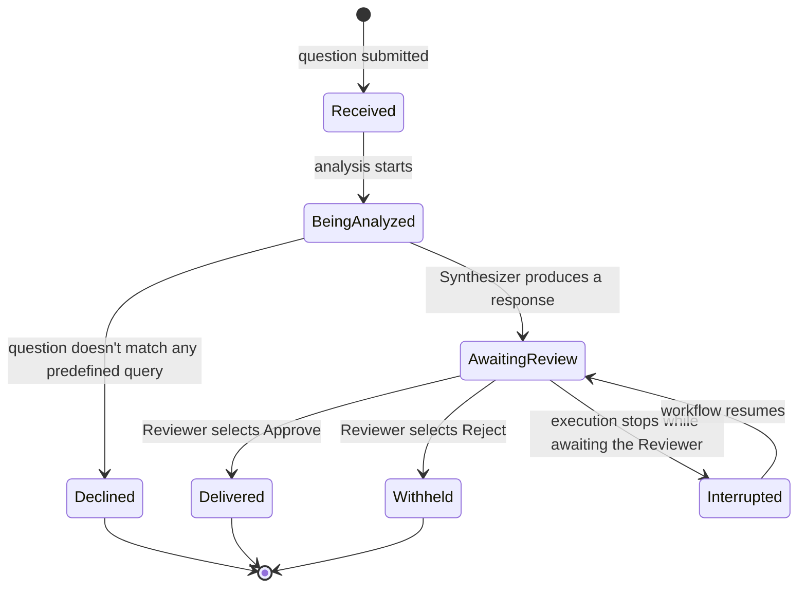

---
daksh:
  type: solution-spec
  subtype: null
  stage: "30c"
  module: ORCHESTRATION
---

# ORCHESTRATION Solution

This is the Solution spec for the **ORCHESTRATION** module — the single
module this project registers (architecture decision-09,
[`docs/system-architecture.md`](../../system-architecture.md#module-decomposition)).
It implements the three BRD use cases
([`docs/business-requirements.md`](../../business-requirements.md), approved
2026-09-07) and the build order
[`docs/implementation-roadmap.md`](../../implementation-roadmap.md)
(approved 2026-09-07) lays out. Where Architecture fixed the platform this
module runs on, this document fixes the *business* problem it solves: what
a request looks like from the outside, what states it moves through, and
what happens when things go wrong — content the BRD does not already
cover. Experience Design (stage 40) is not selected for this module (see
[§Handoff Boundaries](#handoff-boundaries-for-experience-design-and-system));
this Solution stands alone as System's (30d) only upstream input beyond the
BRD. The audience is whoever authors System next, plus the PTL signing off.

<details><summary>Graph: What problem does this module solve, and how do responsibilities and information move through it?</summary>

```items
---
id: orchestration-solution-cognition
title: ORCHESTRATION Solution cognition
default_open_depth: 1
default_color_by: kind
color_palette_source: .daksh/color-palette.json
width: 95vw
---
Business Flows:
  - flow-01 :: UC-001 Ask a question, get an approved answer | kind: flow | summary: "End-to-end happy path from question to approved response." | spec: [business-requirements.md §Use Cases](../../business-requirements.md#use-cases) | actor: "Business User" | trigger: "Business User submits a natural-language question" | outcome: "Approved, structured response is shown to the Business User"
  - flow-02 :: UC-002 Reject a synthesized response | kind: flow | summary: "Reviewer rejects a proposed answer; the response is withheld and the workflow halts for that thread — no retry or replan." | spec: [business-requirements.md §Use Cases](../../business-requirements.md#use-cases) | actor: "Reviewer" | trigger: "Reviewer selects Reject on a synthesized response" | outcome: "Response withheld; workflow terminates for that thread"
  - flow-03 :: UC-003 Resume an interrupted workflow | kind: flow | summary: "A paused/interrupted workflow resumes execution from its last checkpointed state." | spec: [business-requirements.md §Use Cases](../../business-requirements.md#use-cases) | actor: "Reviewer" | trigger: "Workflow execution is interrupted after pausing for approval" | outcome: "Workflow continues from persisted state without losing prior task results"
  - flow-04 :: SS-ORCHESTRATION-004 Ask an unsupported question | kind: flow | summary: "A question doesn't match any predefined query intent (constraint-02); the module declines clearly instead of guessing or erroring silently. Not covered by any BRD use case." | spec: [§Business Flow Inventory](solution.md#business-flow-inventory) | actor: "Business User" | trigger: "Question cannot be mapped to one of the predefined queries" | outcome: "Business User is told plainly the question isn't supported yet; no partial or incorrect answer is given"
Solution Requirements:
  - requirement-05 :: Graceful decline for unsupported questions | kind: requirement | summary: "An unmatched question produces a clear decline, never a guess, a crash, or a silent timeout." | spec: [§Business Flow Inventory](solution.md#business-flow-inventory) | acceptance: "Every question that fails intent-matching against the predefined queries (constraint-02) reaches flow-04's outcome, never the Synthesizer."
  - requirement-06 :: Single authoritative business state per request | kind: requirement | summary: "At any moment, a request has exactly one current business state — never two at once, never none. See the Request Lifecycle diagram below." | spec: [§Business States, Decisions, and Recovery Intent](solution.md#business-states-decisions-and-recovery-intent) | acceptance: "No path through the Request Lifecycle diagram leaves a request in more than one state, or in an undefined state."
  - requirement-07 :: External integration isolation | kind: requirement | summary: "A database or LLM provider outage fails only the request that was calling it, never any other in-flight request." | spec: [§Integration Intent](solution.md#integration-intent) | acceptance: "Two concurrent requests, one hitting a failed external call and one not, produce one failure and one unaffected success."
  - requirement-08 :: No incidental data exposure | kind: requirement | summary: "A response never leaks schema names, table names, or raw query text — only the business answer the question asked for." | spec: [§Integration Intent](solution.md#integration-intent) | acceptance: "Every flow-01/flow-04 response is reviewable against this rule before Approve is even offered."
  - requirement-09 :: Every outcome is traced, not just successes | kind: requirement | summary: "Declines (flow-04) and withheld responses (flow-02) appear in the orchestration trace exactly like approved ones — extends architecture's constraint-observability to the failure paths this Solution stage adds." | spec: [system-architecture.md constraint-observability](../../system-architecture.md#quality-requirements) | acceptance: "The trace for a declined or withheld request shows the same level of detail as an approved one, minus the response body itself."
  - requirement-10 :: Planned pauses and involuntary interruptions are distinguishable | kind: requirement | summary: "The trace must let someone tell apart a request that is waiting for approval from one that crashed mid-flight — the BRD's flow-03 treats both as one 'interrupted' case; this stage requires the trace to keep them separate even though both recover the same way." | spec: [§Business States, Decisions, and Recovery Intent](solution.md#business-states-decisions-and-recovery-intent) | acceptance: "Given two interrupted requests, one paused-for-approval and one crashed, the trace shows which is which without needing to inspect checkpoint internals."
  - requirement-11 :: A declined question is never silently dropped | kind: requirement | summary: "Every decline is visible in the trace (requirement-09) even though the Business User's own path ends at a plain decline message with no further action offered." | spec: [§Business Flow Inventory](solution.md#business-flow-inventory) | acceptance: "A decline produces exactly one trace entry, never zero."
  - requirement-12 :: Recovery never loses the original question | kind: requirement | summary: "Resuming an interrupted request restores not just partial task results but the original natural-language question itself — losing the question while keeping partial results would make the resumed answer meaningless." | spec: [§Business States, Decisions, and Recovery Intent](solution.md#business-states-decisions-and-recovery-intent) | acceptance: "A resumed request's final response can still be traced back to the exact original question text."
Integration Points:
  - iface-business-db :: Business Database (read-only) | kind: interface | summary: "The existing business/analysis database the Query Execution Tool reads from. Named here as a formal integration point for the first time — Architecture referenced it only informally." | spec: [business-requirements.md constraint-01](../../business-requirements.md#scope) | shape: "Read-only; exact queries and schema are System (30d) / TRD (50a) work" | version: "unversioned — pre-existing external system" | compatibility: "breaking — this module does not own its schema"
  - iface-llm-provider :: LLM Provider | kind: interface | summary: "The hosted LLM (Google Gemini, per TRD decision-28) the Planner, Calculation Agent, and Synthesizer all call. One shared external dependency, not three." | spec: [system-architecture.md Technology Baseline](../../system-architecture.md#technology-baseline) | shape: "Prompt/response per agent; exact contracts are TRD (50a) work" | version: "unversioned — third-party service" | compatibility: "breaking — outside this module's control"
  - iface-checkpoint-db :: Checkpoint DB Interface | kind: interface | summary: "Durable state store for WorkflowState, already decided as Postgres (architecture decision-10). Reused here as the thing that makes flow-03's resume possible." | spec: [system-architecture.md §Module Interactions and Interfaces](../../system-architecture.md#module-interactions-and-interfaces) | shape: "Not yet defined — no checkpointer implementation exists" | version: "unversioned (not yet built)" | compatibility: "additive — no consumers exist yet to break"
Decisions:
  - decision-19 :: Unsupported questions are declined immediately, not queued for a human | kind: decision | summary: "flow-04 declines automatically; it never routes an unmatched question to the Reviewer for manual handling." | spec: [§Business Flow Inventory](solution.md#business-flow-inventory) | alternatives: "Routing unsupported questions to the Reviewer for manual triage was considered and rejected — the Reviewer's role is approving/rejecting synthesized answers (decision-07), not manually answering raw questions; blending the two roles undoes BRD decision-07's separation." | reversal_trigger: "If the predefined-query set (constraint-02) grows large enough that 'unsupported' becomes rare and worth a human second look, revisit."
  - decision-20 :: Requests are isolated — one failure never cascades | kind: decision | summary: "An external integration failure fails only its own request; no shared state links one request's failure to another's success." | spec: [§Integration Intent](solution.md#integration-intent) | alternatives: "A shared connection pool with no per-request isolation was considered and rejected — a single LLM or database outage would then fail every concurrent request, defeating BRD goal-03's resumability guarantee for the requests that were never actually affected." | reversal_trigger: "If the module ever needs cross-request coordination (e.g. a shared rate limit), isolation must be revisited deliberately, not broken by accident."
  - decision-21 :: Declined and withheld outcomes are terminal, matching Reject's no-retry philosophy | kind: decision | summary: "A decline (flow-04) and a withheld response (flow-02) both end the thread the same way BRD decision-05 ends a Reject — no automatic revision, replan, or retry." | spec: [§Business States, Decisions, and Recovery Intent](solution.md#business-states-decisions-and-recovery-intent) | alternatives: "Auto-retrying a declined question against a fuzzy-matched predefined query was considered and rejected — it risks answering a different question than the one asked, which is worse than declining." | reversal_trigger: "If declines turn out to be frequent and usually near-misses, consider a suggestion ('did you mean...') instead of a bare decline — still not an automatic retry."
  - decision-22 :: Recovery is idempotent by construction, not by retry-detection | kind: decision | summary: "Resuming never re-runs a completed task because completed results are checkpointed at task granularity (extends BRD FR-008/FR-015) — there is no separate dedup/detection layer catching accidental re-runs." | spec: [§Business States, Decisions, and Recovery Intent](solution.md#business-states-decisions-and-recovery-intent) | alternatives: "A dedup layer that detects and discards re-run results was considered and rejected as unnecessary complexity — if checkpointing is granular enough, there is nothing to accidentally re-run in the first place." | reversal_trigger: "If System (30d) finds a case where task-granularity checkpointing genuinely cannot prevent a re-run, add a dedup layer then, not preemptively."
Constraints:
  - constraint-no-silent-retry :: No automatic retry on decline or withhold | kind: constraint | summary: "Only the Business User resubmitting a question starts a new attempt — nothing in the module retries on its own (decision-21)." | spec: [§Business States, Decisions, and Recovery Intent](solution.md#business-states-decisions-and-recovery-intent) | source: "decision-05 (BRD), decision-21 (this doc)"
  - constraint-single-active-state :: A request has exactly one active state | kind: constraint | summary: "The Request Lifecycle diagram has no concurrent-state path — enforces requirement-06." | spec: [§Business States, Decisions, and Recovery Intent](solution.md#business-states-decisions-and-recovery-intent) | source: "requirement-06"
  - constraint-integration-timeout :: External calls must be bounded, never indefinite | kind: constraint | summary: "A call to the Business Database or LLM Provider that never returns would leave a request stuck in Being Analyzed forever — every such call needs a bounded wait (exact duration is TRD work)." | spec: [§Integration Intent](solution.md#integration-intent) | source: "requirement-07, iface-business-db, iface-llm-provider"
  - constraint-decline-tone :: A decline reads as \"not supported yet,\" never as an error | kind: constraint | summary: "Business-level intent only — the exact wording is Experience Design's job if that stage is ever added for this module; this constraint just rules out error-style phrasing." | spec: [§Business Flow Inventory](solution.md#business-flow-inventory) | source: "requirement-05"
  - constraint-recovery-idempotent :: Resuming never re-runs an already-completed task | kind: constraint | summary: "Extends BRD FR-008/FR-015 into an explicit business-facing guarantee, not just an implementation detail — enforces decision-22." | spec: [§Business States, Decisions, and Recovery Intent](solution.md#business-states-decisions-and-recovery-intent) | source: "decision-22, business-requirements.md FR-008/FR-015"
  - constraint-single-decline-per-question :: At most one decline per question attempt | kind: constraint | summary: "A question attempt never produces a partial decline followed by a real answer — that mixed outcome would be more confusing than either a clean decline or a clean answer." | spec: [§Business Flow Inventory](solution.md#business-flow-inventory) | source: "requirement-05, requirement-11"

user-01 :: Business User | kind: user | summary: "Asks natural-language data questions and consumes the approved answer." | spec: [business-requirements.md §Stakeholders](../../business-requirements.md#stakeholders) | role: "Business User" | audience: end_customer | status: placeholder
user-02 :: Reviewer / Approver | kind: user | summary: "Reviews the synthesized response and selects Approve or Reject." | spec: [business-requirements.md §Stakeholders](../../business-requirements.md#stakeholders) | role: "Reviewer" | audience: client | status: placeholder
goal-01 :: Natural-language data Q&A | kind: goal | summary: "Let users get sales/data answers in plain English instead of writing SQL." | spec: [business-requirements.md §Goals](../../business-requirements.md#goals) | success_measure: "Representative business question answered end-to-end without the user writing SQL or performing manual calculation."
goal-03 :: Resumable, observable orchestration | kind: goal | summary: "The workflow can pause, checkpoint, resume, and expose its internal decisions for demo and debugging." | spec: [business-requirements.md §Goals](../../business-requirements.md#goals) | success_measure: "A paused workflow resumes from persisted state and every stage of its trace is inspectable."
milestone-02 :: Human-in-the-loop interrupt/resume demonstrated | kind: milestone | summary: "Workflow pauses after synthesis, persists state, and resumes correctly on Approve; on Reject it halts cleanly instead." | spec: [implementation-roadmap.md §Milestones](../../implementation-roadmap.md#milestones) | due: "Week 2" | definition_of_done: "A paused workflow is resumed from checkpointed Postgres state on Approve, and on Reject the workflow terminates for that thread with no retry (decision-05) — both paths exercised via the Review AG-UI Channel."

edges:
  - user-01 -experiences-> flow-01
  - user-01 -experiences-> flow-03
  - user-01 -experiences-> flow-04
  - user-02 -experiences-> flow-01
  - user-02 -experiences-> flow-02
  - iface-business-db -enables-> flow-01
  - iface-llm-provider -enables-> flow-01
  - iface-llm-provider -enables-> flow-04
  - iface-checkpoint-db -enables-> flow-03
  - requirement-05 -serves-> goal-01
  - requirement-06 -serves-> goal-03
  - requirement-07 -serves-> goal-03
  - requirement-08 -serves-> goal-01
  - requirement-09 -serves-> goal-03
  - requirement-10 -serves-> goal-03
  - requirement-11 -serves-> goal-01
  - requirement-12 -serves-> goal-03
  - requirement-10 -serves-> milestone-02
  - requirement-12 -serves-> milestone-02
  - decision-19 -governs-> flow-04
  - decision-20 -governs-> requirement-07
  - decision-21 -governs-> flow-02
  - decision-21 -governs-> flow-04
  - decision-22 -governs-> flow-03
  - constraint-no-silent-retry -governs-> flow-02
  - constraint-no-silent-retry -governs-> flow-04
  - constraint-single-active-state -governs-> requirement-06
  - constraint-integration-timeout -governs-> iface-llm-provider
  - constraint-integration-timeout -governs-> iface-business-db
  - constraint-decline-tone -governs-> flow-04
  - constraint-recovery-idempotent -governs-> flow-03
  - constraint-single-decline-per-question -governs-> flow-04
```

</details>

## Scope and BRD Lineage

This Solution covers the entire ORCHESTRATION module (architecture
decision-09): every BRD use case, plus one flow the BRD never named
(flow-04, below). It implements BRD goal-01 (natural-language Q&A),
goal-02 (the approval gate), and goal-03 (resumable, observable
orchestration) — the same three goals the BRD itself traces to. Nothing
here is out of scope relative to the BRD; this document goes narrower and
deeper into the *business* mechanics the BRD left implicit, not wider into
new product territory.

## Actors, Needs, and Expected Outcomes

Two actors, reused verbatim from the BRD (`user-01` Business User,
`user-02` Reviewer — `user-03` PTL does not experience any flow, only
owns decisions and milestones, so it is not repeated here). The Business
User needs a plain-English answer without writing SQL; their expected
outcome is either a delivered response (flow-01), a clear decline
(flow-04), or — if a Reviewer rejects — an honest "this didn't go through"
rather than silence. The Reviewer needs to see exactly what the system
would tell the Business User before it does, with enough context to judge
it correctly; their expected outcome is a gate they can trust, not a
rubber stamp — decision-05's no-retry-after-Reject already establishes
that saying no is a real, final answer, not a request for a redo.

## Module Responsibilities, Boundaries, and Dependencies

ORCHESTRATION owns: interpreting a question, deciding what data/calculation
work it needs, running that work, synthesizing a response, and gating that
response on human approval. It does **not** own: the business database's
schema or data (it only reads, per `iface-business-db` and BRD
constraint-01), user identity or authentication (BRD constraint-03,
architecture constraint-security), or how questions get typed in or
responses get displayed (that is Experience Design's territory, not
selected for this module — see [Handoff
Boundaries](#handoff-boundaries-for-experience-design-and-system)). Its
two external dependencies, `iface-business-db` and `iface-llm-provider`,
are both named here for the first time as formal integration points —
Architecture treated the database informally and the LLM provider only as
a line in `backend/.env.example`.

## Business Flow Inventory

Four flows — three from the BRD, reused with their original IDs and
attributes, plus one this Solution stage adds:

| ID | Flow | Traces to |
|---|---|---|
| SS-ORCHESTRATION-001 (`flow-01`) | Ask a question, get an approved answer | UC-001 |
| SS-ORCHESTRATION-002 (`flow-02`) | Reject a synthesized response | UC-002 |
| SS-ORCHESTRATION-003 (`flow-03`) | Resume an interrupted workflow | UC-003 |
| SS-ORCHESTRATION-004 (`flow-04`) | Ask an unsupported question | constraint-02 (no BRD use case covers this) |

`flow-04` exists because BRD constraint-02 ("predefined queries only")
implies some questions won't match anything, but no BRD use case says what
happens then. Decision-19 settles it: decline immediately, never route to
a human, never guess.

## Integration Intent

Three integration points, one is genuinely new business framing on top of
an already-decided technology (`iface-checkpoint-db`, Postgres per
architecture decision-10), two are named formally for the first time:

- **`iface-business-db`** — the module reads existing business data to
  answer questions. It never writes (BRD constraint-01). Isolation
  (decision-20) means one request's read failure never blocks another's.
- **`iface-llm-provider`** — one shared hosted LLM, called by the Planner,
  Calculation Agent, and Synthesizer alike. Treating it as one integration
  point (not three) matters for `requirement-07`: an outage here is a
  single class of failure to isolate, not three.
- **`iface-checkpoint-db`** — the durable memory that makes `flow-03`
  possible. This Solution stage adds no new decision about it; it exists
  here only because a flow depends on it.

`constraint-integration-timeout` applies to both external calls
(`iface-business-db`, `iface-llm-provider`): neither may hang indefinitely,
or a request is stuck in "Being Analyzed" forever with no way out.

## High-Level Payload Intent

No field names, schemas, or transport — just what each flow needs and
produces, in business terms:

- **flow-01** needs a natural-language question; produces a structured,
  approved answer with whatever supporting numbers the question implied.
- **flow-02** needs a Reviewer's Reject decision on an already-synthesized
  answer; produces nothing user-facing — the thread simply ends withheld.
- **flow-03** needs a reference to a previously interrupted request;
  produces continued execution using whatever partial results were already
  computed, with no repeated work.
- **flow-04** needs a natural-language question that turns out to be
  unsupported; produces a plain decline message, never a partial or
  guessed answer.

## Business States, Decisions, and Recovery Intent

The BRD names a technical `Task.status` enum (`PENDING`/`RUNNING`/
`COMPLETED`/`FAILED`) for individual plan tasks, but never names a
business-facing state for the *request as a whole* — that gap is what the
Request Lifecycle below fills. (This is narrative business context, not a
formal `StateMachine` graph entity — that promotion belongs to System,
30d, which owns module-internal implementation; see [Handoff
Boundaries](#handoff-boundaries-for-experience-design-and-system).)



`constraint-single-active-state` (requirement-06) means a request is
always in exactly one of these boxes. Two failure/recovery paths matter
that the BRD does not distinguish:

- **Normal wait vs. involuntary interruption.** `AwaitingReview` itself is
  not a failure — it is the Human Approval pause the BRD requires (goal-02),
  and a request can sit there indefinitely waiting on the Reviewer. BRD
  `flow-03`'s trigger is specifically "interrupted *after* pausing for
  approval": a crash or restart while a request is in `AwaitingReview`
  looks, from outside, exactly like a request that is simply waiting —
  both show no activity. `requirement-10` requires the trace to tell the
  two apart (an ordinary wait vs. a wait that needs `iface-checkpoint-db`
  to recover from), even though both resume into the same `AwaitingReview`
  state. This Solution stage names the distinction; System (30d) decides
  how the implementation detects it.
- **Decline vs. Reject.** Both are terminal, no-retry outcomes
  (`constraint-no-silent-retry`, decision-21), but they happen for
  different reasons at different points: a decline (`flow-04`) means the
  system never understood the question; a reject (`flow-02`) means a
  human disagreed with a fully-formed answer. Conflating them would hide
  which failure mode actually happened most often.
- **Recovery must not lose the question, and must not repeat work.**
  `requirement-12` and `decision-22`/`constraint-recovery-idempotent`
  cover this together: a resumed request keeps its original question text,
  and never re-runs a task that already completed before the interruption.

## Handoff Boundaries for Experience Design and System

**Experience Design (stage 40)** is not currently selected for this
module (`manifest.module_config.ORCHESTRATION.stages_selected` omits
`40`). If it is added later, it owns: the exact screens for `/chat` and
`/review`, how `Received`/`BeingAnalyzed`/`Declined` render as UI states,
and the wording of the decline message `flow-04` produces. Nothing in this
document should be read as a UI contract.

**System (30d)** owns everything this document deliberately left out:
exact data shapes for each event and state, the concrete mechanism behind
`iface-business-db`/`iface-llm-provider`/`iface-checkpoint-db`, and how
`constraint-integration-timeout`'s "bounded wait" becomes an actual number.

## Open Questions

No open questions remain at the Solution level — every ambiguity resolved
into a decision, a requirement, or an explicit deferral to System/TRD
(`iface-*` shapes, `constraint-integration-timeout`'s exact duration).

## Approval

Approved by: Vara
Role:        PTL
Date:        2026-09-07
Hash:        146be4bdab50…
