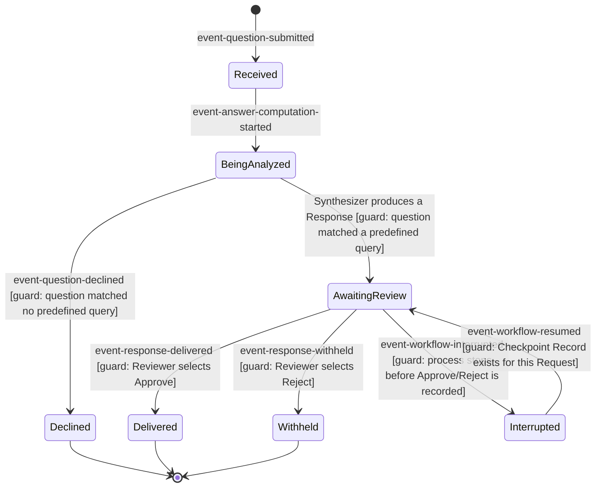

---
daksh:
  type: system-spec
  subtype: null
  stage: "30d"
  module: ORCHESTRATION
---

# ORCHESTRATION System

This is the System spec for **ORCHESTRATION** — the logical behavior
behind the business flows [`solution.md`](solution.md) (approved
2026-09-07) already named. Where Solution described the problem in
business language (a request gets received, analyzed, and either
delivered, withheld, or declined), this document makes that mechanical:
the closed state list, the guarded transitions, the logical data each
state carries, and what "quality" means in terms this project can check.
No screens, no libraries, no schemas as code — those are TRD (50a) work.
The audience is whoever writes the TRD next.

<details><summary>Graph: What must this module do after each action?</summary>

```items
---
id: orchestration-system-cognition
title: ORCHESTRATION System cognition
default_open_depth: 1
default_color_by: kind
color_palette_source: .daksh/color-palette.json
width: 95vw
---
Events:
  - event-question-submitted :: Question submitted | kind: event | summary: "Business User's question arrives. First event of SY-001 and SY-004." | spec: [§State Machines](system.md#state-machines) | payload_shape: "a Request (datamodel-request) in state Received, carrying the original question text"
  - event-answer-computation-started :: Analysis started | kind: event | summary: "Received → BeingAnalyzed transition." | spec: [§State Machines](system.md#state-machines) | payload_shape: "Request transitions to BeingAnalyzed; no new logical fields beyond datamodel-request"
  - event-response-delivered :: Response delivered | kind: event | summary: "SY-001's terminal event — Approve reaches the Business User." | spec: [§State Machines](system.md#state-machines) | payload_shape: "a Response (datamodel-response) linked to its Request"
  - event-response-withheld :: Response withheld | kind: event | summary: "SY-002's terminal event — Reject ends the thread." | spec: [§State Machines](system.md#state-machines) | payload_shape: "a Request reference only; no Response payload leaves the system"
  - event-question-declined :: Question declined | kind: event | summary: "SY-004's terminal event." | spec: [§State Machines](system.md#state-machines) | payload_shape: "a Request reference plus a Decline Reason (datamodel-decline-reason), never free text"
  - event-workflow-interrupted :: Workflow interrupted | kind: event | summary: "AwaitingReview → Interrupted — execution stops while a Request is waiting on the Reviewer." | spec: [§State Machines](system.md#state-machines) | payload_shape: "a Checkpoint Record (datamodel-checkpoint) capturing the Request's state at the moment of interruption"
  - event-workflow-resumed :: Workflow resumed | kind: event | summary: "Interrupted → AwaitingReview — SY-003's terminal event." | spec: [§State Machines](system.md#state-machines) | payload_shape: "a Request restored from its Checkpoint Record, original question intact (SY-010)"
  - event-integration-failure :: External integration failed | kind: event | summary: "A call to the Business Database or LLM Provider fails for one Request." | spec: [§Logical Interfaces](system.md#logical-interfaces) | payload_shape: "a Request reference plus which interface (iface-business-db or iface-llm-provider) failed"
Data Models:
  - datamodel-request :: Request | kind: datamodel | summary: "The entity whose lifecycle the Request Lifecycle state machine tracks." | spec: [§Logical Data](system.md#logical-data) | shape: "original question text, current state, timestamps, reference to its Response and/or Checkpoint Record if any"
  - datamodel-plan :: Plan | kind: datamodel | summary: "The Planner's structured output — formalizes what the BRD described only in prose." | spec: [business-requirements.md §Data Models](../../business-requirements.md#data-models) | shape: "an ordered list of Task references, each with id, description, executor, depends_on, and status (PENDING/RUNNING/COMPLETED/FAILED per BRD decision-04)"
  - datamodel-response :: Synthesized Response | kind: datamodel | summary: "The Synthesizer's output before Human Approval decides its fate." | spec: [§Logical Data](system.md#logical-data) | shape: "the answer content plus whatever supporting numbers the question implied — never schema names or raw query text (SY-006)"
  - datamodel-checkpoint :: Checkpoint Record | kind: datamodel | summary: "The persisted snapshot that makes SY-003's resume possible." | spec: [§Logical Data](system.md#logical-data) | shape: "Request reference, current state, partial task results, and the original question text (SY-010) — written to iface-checkpoint-db"
  - datamodel-decline-reason :: Decline Reason | kind: datamodel | summary: "A closed category explaining why a question was declined — never the raw LLM reasoning." | spec: [§Logical Data](system.md#logical-data) | shape: "one of a fixed set of reason categories (exact set is TRD work); never free text"
Logical Interfaces:
  - iface-business-db :: Business Database (read-only) | kind: interface | summary: "Reused from Solution; System adds failure behavior." | spec: [solution.md §Integration Intent](solution.md#integration-intent) | shape: "read-only; exact queries are TRD work" | version: "unversioned — pre-existing external system" | compatibility: "breaking — this module does not own its schema" | failure_shape: "timeout or connection error; must not hang past the quality budget below (constraint-integration-timeout)"
  - iface-llm-provider :: LLM Provider | kind: interface | summary: "Reused from Solution; System adds failure behavior." | spec: [solution.md §Integration Intent](solution.md#integration-intent) | shape: "prompt/response per agent; exact contracts are TRD work" | version: "unversioned — third-party service" | compatibility: "breaking — outside this module's control" | failure_shape: "timeout, rate-limit, or malformed response; same bounded-wait budget as iface-business-db"
  - iface-checkpoint-db :: Checkpoint DB Interface | kind: interface | summary: "Reused from Architecture/Solution; System adds failure behavior." | spec: [system-architecture.md §Module Interactions and Interfaces](../../system-architecture.md#module-interactions-and-interfaces) | shape: "reads/writes datamodel-checkpoint, keyed by Request" | version: "unversioned (not yet built)" | compatibility: "additive — no consumers exist yet to break" | failure_shape: "a write failure here means the interruption cannot be safely recovered from — treated as terminal, never silently retried (matches constraint-no-silent-retry's spirit)"
Business Rules:
  - invariant-single-checkpoint-per-request :: At most one active checkpoint per Request | kind: invariant | summary: "A Request never has two live Checkpoint Records — the newest write replaces, it does not add." | spec: [§Business Rules and Validation](system.md#business-rules-and-validation) | violation_signal: "Two Checkpoint Records exist for the same Request with no explicit supersede relationship."
  - invariant-decline-no-plan :: A declined Request never has a Plan | kind: invariant | summary: "Declining happens before the Planner produces a Plan (SS decision-19) — a Plan and a Decline Reason must never coexist for the same Request." | spec: [§Business Rules and Validation](system.md#business-rules-and-validation) | violation_signal: "A Request has both a datamodel-plan and a datamodel-decline-reason."
  - invariant-response-immutable :: A synthesized Response never changes after creation | kind: invariant | summary: "Once the Synthesizer produces a Response, its content is fixed — Approve/Reject decides its fate, nothing edits it." | spec: [§Business Rules and Validation](system.md#business-rules-and-validation) | violation_signal: "A Response's content differs between when it entered AwaitingReview and when Approve/Reject was recorded."
  - invariant-task-status-closed :: Task.status is exactly one of four values | kind: invariant | summary: "Formalizes BRD decision-04 as a System-level rule: every Task is always in exactly one of PENDING/RUNNING/COMPLETED/FAILED, never a fifth value." | spec: [business-requirements.md §Data Models](../../business-requirements.md#data-models) | violation_signal: "A Task's status field holds any value outside the closed four."
Quality Budgets:
  - constraint-response-latency-budget :: BeingAnalyzed is time-bounded | kind: constraint | summary: "Tightens architecture constraint-perf: still no numeric SLA, but time in BeingAnalyzed is logically bounded by iface-business-db/iface-llm-provider's timeout budget plus reasonable orchestration overhead — it cannot be unbounded." | spec: [system-architecture.md constraint-perf](../../system-architecture.md#quality-requirements) | source: "constraint-integration-timeout"
  - constraint-trace-completeness-budget :: Every state transition is logged | kind: constraint | summary: "Tightens architecture constraint-observability to a concrete System-level target: 100% of Request Lifecycle transitions carry a timestamp and the triggering event." | spec: [system-architecture.md constraint-observability](../../system-architecture.md#quality-requirements) | source: "SY-007"
  - constraint-checkpoint-freshness :: A checkpoint exists before AwaitingReview begins | kind: constraint | summary: "The Checkpoint Record must be written before a Request enters AwaitingReview, not after — writing it late would mean an interruption during the write window loses the pause-for-approval state entirely." | spec: [§State Machines](system.md#state-machines) | source: "SY-003, SY-010"

statemachine-request :: Request Lifecycle | kind: statemachine | summary: "The closed state machine every Request moves through — formalizes Solution's narrative version with guarded transitions and invariants." | spec: [§State Machines](system.md#state-machines) | entity: "Request (datamodel-request)" | states: "Received, BeingAnalyzed, AwaitingReview, Interrupted, Declined, Delivered, Withheld" | initial_state: "Received" | terminal_states: "Declined, Delivered, Withheld" | transitions: "see §State Machines for the full guarded transition table" | invariants_per_state: "see §State Machines"
comp-planner :: Planner Agent | kind: component | summary: "Reused from Architecture — produces datamodel-plan or datamodel-decline-reason." | spec: [system-architecture.md §Frontend, Backend, Database, and Deployment Architecture](../../system-architecture.md#frontend-backend-database-and-deployment-architecture) | boundary: "not yet implemented"
comp-orchestrator :: Orchestration Layer | kind: component | summary: "Reused from Architecture — drives Request Lifecycle transitions; the only component that touches the state machine directly." | spec: [system-architecture.md §Frontend, Backend, Database, and Deployment Architecture](../../system-architecture.md#frontend-backend-database-and-deployment-architecture) | boundary: "not yet implemented"
comp-query-tool :: Query Execution Tool | kind: component | summary: "Reused from Architecture — sole consumer of iface-business-db." | spec: [system-architecture.md §Frontend, Backend, Database, and Deployment Architecture](../../system-architecture.md#frontend-backend-database-and-deployment-architecture) | boundary: "not yet implemented"
comp-calc-agent :: Calculation Agent | kind: component | summary: "Reused from Architecture — consumes iface-llm-provider for aggregation." | spec: [system-architecture.md §Frontend, Backend, Database, and Deployment Architecture](../../system-architecture.md#frontend-backend-database-and-deployment-architecture) | boundary: "not yet implemented"
comp-synthesizer :: Synthesizer Agent | kind: component | summary: "Reused from Architecture — sole producer of datamodel-response." | spec: [system-architecture.md §Frontend, Backend, Database, and Deployment Architecture](../../system-architecture.md#frontend-backend-database-and-deployment-architecture) | boundary: "not yet implemented"
comp-checkpoint-store :: Checkpoint Store (Postgres) | kind: component | summary: "Reused from Architecture — sole producer of datamodel-checkpoint." | spec: [system-architecture.md §Frontend, Backend, Database, and Deployment Architecture](../../system-architecture.md#frontend-backend-database-and-deployment-architecture) | boundary: "not yet wired"

edges:
  - comp-orchestrator -enables-> statemachine-request
  - event-question-submitted -enables-> statemachine-request
  - event-answer-computation-started -enables-> statemachine-request
  - event-response-delivered -enables-> statemachine-request
  - event-response-withheld -enables-> statemachine-request
  - event-question-declined -enables-> statemachine-request
  - event-workflow-interrupted -enables-> statemachine-request
  - event-workflow-resumed -enables-> statemachine-request
  - comp-orchestrator -produces-> event-question-submitted
  - comp-orchestrator -produces-> event-answer-computation-started
  - comp-orchestrator -produces-> event-response-delivered
  - comp-orchestrator -produces-> event-response-withheld
  - comp-orchestrator -produces-> event-workflow-interrupted
  - comp-orchestrator -produces-> event-workflow-resumed
  - comp-orchestrator -produces-> event-integration-failure
  - comp-planner -produces-> event-question-declined
  - comp-planner -produces-> datamodel-plan
  - comp-planner -produces-> datamodel-decline-reason
  - comp-synthesizer -produces-> datamodel-response
  - comp-checkpoint-store -produces-> datamodel-checkpoint
  - comp-orchestrator -produces-> datamodel-request
  - iface-business-db -enables-> comp-query-tool
  - iface-llm-provider -enables-> comp-planner
  - iface-llm-provider -enables-> comp-calc-agent
  - iface-llm-provider -enables-> comp-synthesizer
  - iface-checkpoint-db -enables-> comp-checkpoint-store
  - invariant-single-checkpoint-per-request -governs-> datamodel-checkpoint
  - invariant-decline-no-plan -governs-> datamodel-plan
  - invariant-response-immutable -governs-> datamodel-response
  - invariant-task-status-closed -governs-> datamodel-plan
  - constraint-response-latency-budget -governs-> statemachine-request
  - constraint-trace-completeness-budget -governs-> statemachine-request
  - constraint-checkpoint-freshness -governs-> datamodel-checkpoint
```

</details>

## Scope and Solution Lineage

Every behavior here traces to one of Solution's four flows
(`SS-ORCHESTRATION-001` through `004`). Nothing new in scope is
introduced — this document goes one level more mechanical, not one level
wider.

## Testable Behaviors

| ID | Behavior | Traces to |
|---|---|---|
| SY-ORCHESTRATION-001 | A well-formed, matching question produces an approved response | SS-001 |
| SY-ORCHESTRATION-002 | A Reject withholds the response and terminates the thread | SS-002 |
| SY-ORCHESTRATION-003 | An interruption while `AwaitingReview` resumes into `AwaitingReview`, without repeating completed work | SS-003 |
| SY-ORCHESTRATION-004 | An unmatched question is declined, never guessed | SS-004 |
| SY-ORCHESTRATION-005 | A Business Database or LLM Provider failure fails only its own Request | SS-001, SS-004 (requirement-07) |
| SY-ORCHESTRATION-006 | A Response never contains schema names, table names, or raw query text | SS-001, SS-004 (requirement-08) |
| SY-ORCHESTRATION-007 | Every terminal outcome — Delivered, Withheld, Declined — appears in the trace | SS-001, SS-002, SS-004 (requirement-09) |
| SY-ORCHESTRATION-008 | A normal `AwaitingReview` wait and an `Interrupted` wait are distinguishable in the trace | SS-003 (requirement-10) |
| SY-ORCHESTRATION-009 | A decline produces exactly one trace entry | SS-004 (requirement-11) |
| SY-ORCHESTRATION-010 | A resumed Request's response can be traced back to its exact original question text | SS-003 (requirement-12) |
| SY-ORCHESTRATION-011 | Resuming never re-runs a Task already `COMPLETED` before the interruption | SS-003 (decision-22) |
| SY-ORCHESTRATION-012 | No call to `iface-business-db` or `iface-llm-provider` hangs past its bounded wait | SS-001, SS-004 (constraint-integration-timeout) |

## Business Rules and Validation

Four invariants hold regardless of which path a Request takes:

- **`invariant-single-checkpoint-per-request`** — a newest checkpoint
  write replaces, never adds alongside, the previous one.
- **`invariant-decline-no-plan`** — a decline happens before planning;
  a Request is never found holding both a Plan and a Decline Reason.
- **`invariant-response-immutable`** — a synthesized Response's content
  is fixed the moment it exists; Approve/Reject decides its fate, nothing
  edits it afterward.
- **`invariant-task-status-closed`** — formalizes BRD decision-04: a
  Task's status is always exactly one of four values, never a fifth.

## State Machines

The Request Lifecycle, with every guard made explicit:



| State | Invariant that must hold |
|---|---|
| `Received` | No Plan, Response, or Checkpoint Record exists yet for this Request. |
| `BeingAnalyzed` | At most one active Plan exists; no Response exists yet. |
| `AwaitingReview` | Exactly one Response exists (`invariant-response-immutable`); a Checkpoint Record exists (`constraint-checkpoint-freshness`) so this state survives an interruption. |
| `Interrupted` | A Checkpoint Record exists that is sufficient to restore `AwaitingReview` exactly (`invariant-single-checkpoint-per-request`). |
| `Declined` | Terminal — no Plan exists (`invariant-decline-no-plan`); no further transition permitted (`constraint-no-silent-retry`, from Solution). |
| `Delivered` | Terminal — the Response shown to the Business User is byte-for-byte the one that existed in `AwaitingReview`. |
| `Withheld` | Terminal — no further transition permitted (`constraint-no-silent-retry`). |

**Recovery intent:** `constraint-checkpoint-freshness` requires the
Checkpoint Record to exist *before* `AwaitingReview` begins, precisely so
that an interruption during the review wait — the only window BRD's
`flow-03` actually describes — always has something to recover from.
`SY-ORCHESTRATION-011`'s idempotence guarantee (Solution decision-22)
depends on Task-level checkpointing being granular enough that resuming
into `BeingAnalyzed`'s already-completed work is a no-op, not a re-run.

## Logical Data

| Data Model | Shape | Owner | Retention |
|---|---|---|---|
| `datamodel-request` | Question text, current state, timestamps, Response/Checkpoint references | ORCHESTRATION | Lifetime of the request; no long-term archive decided (see Open Questions) |
| `datamodel-plan` | Ordered Task list: id, description, executor, depends_on, status | ORCHESTRATION | Same as its Request |
| `datamodel-response` | Answer content plus supporting numbers | ORCHESTRATION | Same as its Request |
| `datamodel-checkpoint` | Request reference, state, partial results, original question | ORCHESTRATION (persisted via `iface-checkpoint-db`) | Needed only until the Request reaches a terminal state; pruning policy not decided (see Open Questions) |
| `datamodel-decline-reason` | One of a fixed, closed category set — never free text | ORCHESTRATION | Same as its Request |

No data model here has a retention policy longer than the request's own
lifetime — this project has no reporting or analytics requirement over
past requests (BRD scope), so nothing forces data to outlive its request.

## Logical Interfaces

| Interface | Producer | Consumer | Shape | Failure Shape |
|---|---|---|---|---|
| `iface-business-db` | External (pre-existing) | `comp-query-tool` | Read-only; exact queries are TRD work | Timeout/connection error, bounded by the quality budget below |
| `iface-llm-provider` | External (third-party) | `comp-planner`, `comp-calc-agent`, `comp-synthesizer` | Prompt/response per agent; exact contracts are TRD work | Timeout, rate-limit, or malformed response — same bounded wait |
| `iface-checkpoint-db` | `comp-checkpoint-store` | `comp-orchestrator` | Reads/writes `datamodel-checkpoint`, keyed by Request | A write failure here is terminal, never silently retried |

## Quality Budgets

Each tightens an Architecture-level quality requirement into a
System-level, still-non-numeric but logically bounded target:

| Budget | Tightens | Target |
|---|---|---|
| `constraint-response-latency-budget` | constraint-perf | `BeingAnalyzed` duration is bounded by the external-call timeout plus orchestration overhead — never unbounded |
| `constraint-trace-completeness-budget` | constraint-observability | 100% of Request Lifecycle transitions carry a timestamp and triggering event |
| `constraint-checkpoint-freshness` | (new — recovery-specific) | Checkpoint Record exists before `AwaitingReview` begins, not after |

## Verification Obligations

Every `SY-ORCHESTRATION-NNN` behavior and quality budget above needs
evidence before it counts as done; this document does not create that
evidence, only the obligation. Exact `TEST-ORCHESTRATION-NNN` IDs, test
types, and coverage targets are Test Specification (50b) work — using
this document's `SY-*` table and the quality budgets above as its input,
per that stage's own extraction rules.

## Open Questions

- **Checkpoint pruning policy.** `datamodel-checkpoint` has no decided
  retention limit — nothing currently deletes old checkpoints once a
  Request reaches a terminal state. Not a blocker for the POC's build
  order (roadmap milestone-03 doesn't require it), but TRD (50a) should
  decide before this could run unattended for any length of time. `[open]`
- **Exact timeout durations.** `constraint-integration-timeout` and
  `constraint-response-latency-budget` are logically bounded here but
  carry no number yet — TRD (50a) work, not decided in this document.
  `[open]`

## Approval

Approved by: Vara
Role:        PTL
Date:        2026-09-07
Hash:        805aa0d63f1e…
