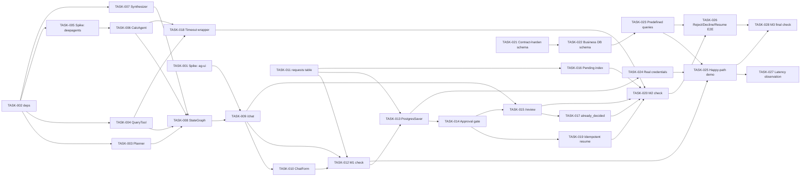

---
daksh:
  type: tasks
  subtype: null
  stage: "50c"
  module: ORCHESTRATION
---

# ORCHESTRATION Tasks

This breaks down the approved [`trd.md`](trd.md) and
[`test-specification.md`](test-specification.md) (both approved
2026-09-07) into a Jira-ready task list, now split across a two-engineer
team (Engineer A, Engineer B; Vara remains PTL) across the roadmap's
three-week build order (`docs/implementation-roadmap.md` decision-14).
See [Team Assignment](#team-assignment) for the split rationale. Every
`TEST-ORCHESTRATION-NNN` (27) appears in at least one task's `Traces to`
field; no exceptions, per this stage's own rule. The audience is
whoever picks up a ticket cold.

## Task Summary

| ID | Summary | Points | Week | Owner | Depends on |
|---|---|---|---|---|---|
| TASK-ORCHESTRATION-001 | Spike: validate ag-ui-langgraph + Gemini | 3 | 1 | Engineer A | none |
| TASK-ORCHESTRATION-002 | Add new dependencies to pyproject.toml | 1 | 1 | Engineer A | none |
| TASK-ORCHESTRATION-003 | Implement Planner node | 3 | 1 | Engineer A | TASK-002 |
| TASK-ORCHESTRATION-004 | Implement Query Execution Tool node | 2 | 1 | Engineer B | TASK-002 |
| TASK-ORCHESTRATION-005 | Spike: validate deepagents subgraph + checkpoint sharing | 3 | 1 | Engineer A | TASK-002 |
| TASK-ORCHESTRATION-006 | Implement Calculation Agent (deepagents) | 5 | 1 | Engineer A | TASK-005 |
| TASK-ORCHESTRATION-007 | Implement Synthesizer node | 3 | 1 | Engineer B | TASK-002 |
| TASK-ORCHESTRATION-008 | Wire the StateGraph (Orchestrator) | 5 | 1 | Engineer B | TASK-003, TASK-004, TASK-006, TASK-007 |
| TASK-ORCHESTRATION-009 | Implement Chat Route (/chat) | 5 | 1 | Engineer A | TASK-001, TASK-008 |
| TASK-ORCHESTRATION-010 | Update ChatForm to use @ag-ui/client | 3 | 1 | Engineer A | TASK-009 |
| TASK-ORCHESTRATION-011 | `requests` table migration | 2 | 1 | Engineer A | none |
| TASK-ORCHESTRATION-012 | Milestone-01 integration check | 3 | 1 | Engineer A & Engineer B | TASK-009, TASK-010, TASK-011 |
| TASK-ORCHESTRATION-013 | Wire PostgresSaver checkpointing | 3 | 2 | Engineer B | TASK-008, TASK-011 |
| TASK-ORCHESTRATION-014 | Implement Human Approval gate | 5 | 2 | Engineer B | TASK-013 |
| TASK-ORCHESTRATION-018 | Bounded external-call timeout wrapper | 2 | 2 | Engineer B | TASK-004, TASK-006 |
| TASK-ORCHESTRATION-019 | Idempotent resume verification | 3 | 2 | Engineer B | TASK-014 |
| TASK-ORCHESTRATION-015 | Implement Review Route (/review) | 5 | 2 | Engineer B | TASK-009, TASK-014 |
| TASK-ORCHESTRATION-016 | Reviewer pending-list index + query | 2 | 2 | Engineer B | TASK-011 |
| TASK-ORCHESTRATION-017 | `already_decided` error handling | 2 | 2 | Engineer B | TASK-015 |
| TASK-ORCHESTRATION-020 | Milestone-02 integration check | 3 | 2 | Engineer A & Engineer B | TASK-015, TASK-016, TASK-017, TASK-018, TASK-019 |
| TASK-ORCHESTRATION-021 | Contract-hardening: business data schema in TRD | 3 | 3-4 | Engineer A | none |
| TASK-ORCHESTRATION-022 | Implement business database schema + seed data | 3 | 3-4 | Engineer A | TASK-021 |
| TASK-ORCHESTRATION-023 | Write predefined queries (constraint-02) | 3 | 3-4 | Engineer A | TASK-022 |
| TASK-ORCHESTRATION-024 | Swap real Postgres/Gemini credentials | 1 | 3-4 | Engineer B | TASK-013 |
| TASK-ORCHESTRATION-025 | Full happy-path demo + trace verification | 3 | 3-4 | Engineer A & Engineer B | TASK-012, TASK-023, TASK-024 |
| TASK-ORCHESTRATION-026 | Reject/Decline/Resume E2E verification | 3 | 3-4 | Engineer A & Engineer B | TASK-020, TASK-023 |
| TASK-ORCHESTRATION-027 | Demo-day latency observation | 1 | 3-4 | Engineer A & Engineer B | TASK-025 |
| TASK-ORCHESTRATION-028 | Milestone-03 final integration check | 2 | 3-4 | Engineer A & Engineer B | TASK-025, TASK-026 |

No task exceeds 8 points; nothing needed splitting.

## Team Assignment

Split by vertical, not by layer — each engineer gets one hard,
interesting LLM/graph component plus a share of simpler infra/UI work,
rather than one person getting all the agent-design work and the other
getting only migrations and UI wiring.

- **Engineer A — Planner, Calculation & Chat Delivery** (11 tasks, 34 pts):
  `TASK-ORCHESTRATION-001`, `-002`, `-003`, `-005`, `-006`, `-009`, `-010`,
  `-011`, `-021`, `-022`, `-023`. Owns the Planner node, the deepagents
  Calculation Agent (the most involved single component in the module),
  the `/chat` route and its frontend wiring, the `requests` table, and
  the business-data chain (contract-hardening through predefined
  queries).
- **Engineer B — Query, Synthesis, Graph Wiring & Approval** (11 tasks,
  33 pts): `TASK-ORCHESTRATION-004`, `-007`, `-008`, `-013`, `-014`,
  `-015`, `-016`, `-017`, `-018`, `-019`, `-024`. Owns the Query
  Execution Tool, the Synthesizer, the StateGraph wiring itself, all of
  checkpointing/approval (the module's other genuinely hard piece — the
  interrupt/resume state machine), and the `/review` surface.
- **Joint — milestone and integration checks** (6 tasks, 15 pts,
  alternating driver): `TASK-ORCHESTRATION-012`, `-020`, `-025`, `-026`,
  `-027`, `-028`. These verify the whole assembled system, not one
  person's slice, so both engineers participate regardless of who owned
  the underlying component work.

The only hard cross-track coupling is where the two chains physically
meet: `TASK-ORCHESTRATION-008` (Engineer B) needs Engineer A's Planner
(`-003`) and Calculation Agent (`-006`) first; `TASK-ORCHESTRATION-009`
(Engineer A) needs Engineer B's StateGraph (`-008`); `TASK-ORCHESTRATION-013`
(Engineer B) needs Engineer A's `requests` table (`-011`). That coupling
exists no matter how the tasks are divided — it is the shape of the
system, not an artifact of this split.

## Dependency Graph

Prose before diagram: Week 1's two spikes (`TASK-001`, `TASK-005`) gate
their respective real implementation tasks (`TASK-009`, `TASK-006`) but
not each other — they can run in either order. `TASK-011` (the `requests`
migration) has no dependency at all and can start immediately, in
parallel with the spikes.



<details><summary>Graph: What can be parallel, what is gated, and who owns each piece?</summary>

```items
---
id: orchestration-tasks-cognition
title: ORCHESTRATION Tasks cognition
default_open_depth: 1
default_color_by: kind
color_palette_source: .daksh/color-palette.json
width: 95vw
---
Week 1 — Spikes and Setup:
  - task-001 :: Spike: validate ag-ui-langgraph + Gemini | kind: task | summary: "Confirm the SSE contract actually works end-to-end before building the real /chat route on top of it." | spec: [§Detailed Task List](tasks.md#detailed-task-list) | estimate: "3" | acceptance: "A minimal script streams at least one ag-ui-protocol event from a Gemini-backed LangGraph node over SSE."
  - task-002 :: Add new dependencies to pyproject.toml | kind: task | summary: "langchain, langchain-google-genai, ag-ui-langgraph, deepagents — pinned versions per TRD Technology Choices." | spec: [trd.md §Technology Choices](trd.md#technology-choices) | estimate: "1" | acceptance: "uv sync succeeds with all four new packages resolved, no version conflicts."
  - task-005 :: Spike: validate deepagents subgraph + checkpoint sharing | kind: task | summary: "Confirm a deepagents graph registered directly as a parent node shares the parent's PostgresSaver (decision-29) before building the real Calculation Agent on top of it." | spec: [trd.md §Persistence Constraints](trd.md#persistence-constraints) | estimate: "3" | acceptance: "A minimal 2-tool-call deepagents run shows 2+ distinct checkpoints under the parent's checkpoint history, not the subgraph's own."
Week 1 — Core Components:
  - task-003 :: Implement Planner node | kind: task | summary: "comp-planner: structured-output LLM call producing Plan or Decline, never both." | spec: [trd.md §Architecture Overview](trd.md#architecture-overview) | estimate: "3" | acceptance: "TEST-ORCHESTRATION-001/002/005/023 pass."
  - task-004 :: Implement Query Execution Tool node | kind: task | summary: "comp-query-tool: deterministic, read-only predefined-query dispatch." | spec: [trd.md §Architecture Overview](trd.md#architecture-overview) | estimate: "2" | acceptance: "TEST-ORCHESTRATION-008 passes; no write statement is ever issued."
  - task-006 :: Implement Calculation Agent (deepagents) | kind: task | summary: "comp-calc-agent per decision-29 — real tool functions (sum/average/percentage_change), registered directly as a node." | spec: [trd.md §Technology Choices](trd.md#technology-choices) | estimate: "5" | acceptance: "TEST-ORCHESTRATION-004/014 pass."
  - task-007 :: Implement Synthesizer node | kind: task | summary: "comp-synthesizer: mandatory final step (BRD decision-03), never skippable, never leaks schema/table names." | spec: [trd.md §Architecture Overview](trd.md#architecture-overview) | estimate: "3" | acceptance: "TEST-ORCHESTRATION-006 passes."
Week 1 — Integration and Chat Interface:
  - task-008 :: Wire the StateGraph (Orchestrator) | kind: task | summary: "comp-orchestrator: the graph structure connecting the four nodes above, enforcing dependency order (FR-005/008/009)." | spec: [trd.md §State Machines](trd.md#state-machines) | estimate: "5" | acceptance: "TEST-ORCHESTRATION-007 passes."
  - task-009 :: Implement Chat Route (/chat) | kind: task | summary: "comp-chat-route via ag-ui-langgraph's add_langgraph_fastapi_endpoint (decision-25)." | spec: [trd.md §API Contracts](trd.md#api-contracts) | estimate: "5" | acceptance: "TEST-ORCHESTRATION-011 passes."
  - task-010 :: Update ChatForm to use @ag-ui/client | kind: task | summary: "Replace the plain fetch call with HttpAgent, rendering streamed events." | spec: [trd.md §Technology Choices](trd.md#technology-choices) | estimate: "3" | acceptance: "TEST-ORCHESTRATION-027 passes."
  - task-011 :: requests table migration | kind: task | summary: "DDL from TRD Data Model — request_state/decline_reason enums, the requests table, the CHECK constraint." | spec: [trd.md §Data Model](trd.md#data-model) | estimate: "2" | acceptance: "TEST-ORCHESTRATION-003 passes."
  - task-012 :: Milestone-01 integration check | kind: task | summary: "Run every Week-1-owned Test ID against the assembled core loop before calling milestone-01 done." | spec: [implementation-roadmap.md §Milestones](../../implementation-roadmap.md#milestones) | estimate: "3" | acceptance: "milestone-01's definition_of_done is met live."
Week 2 — Checkpointing and Approval:
  - task-013 :: Wire PostgresSaver checkpointing | kind: task | summary: "Compile the graph with a real PostgresSaver (decision-23) — the parent only; comp-calc-agent's subgraph stays uncheckpointed on its own." | spec: [trd.md §Persistence Constraints](trd.md#persistence-constraints) | estimate: "3" | acceptance: "TEST-ORCHESTRATION-009 passes."
  - task-014 :: Implement Human Approval gate | kind: task | summary: "Pause after Synthesizer, write the load-bearing checkpoint (constraint-checkpoint-freshness), wait for external resume." | spec: [trd.md §State Machines](trd.md#state-machines) | estimate: "5" | acceptance: "A request reaches AwaitingReview and stays there until resumed."
  - task-018 :: Bounded external-call timeout wrapper | kind: task | summary: "30-second bound (decision-24) around iface-business-db and iface-llm-provider calls." | spec: [trd.md §Idempotency and Failure Contracts](trd.md#idempotency-and-failure-contracts) | estimate: "2" | acceptance: "TEST-ORCHESTRATION-010 passes."
  - task-019 :: Idempotent resume verification | kind: task | summary: "Confirm resuming never re-invokes a Task already COMPLETED, and the original question survives the round trip." | spec: [trd.md §State Machines](trd.md#state-machines) | estimate: "3" | acceptance: "TEST-ORCHESTRATION-019/024/025 pass."
Week 2 — Review Surface:
  - task-015 :: Implement Review Route (/review) | kind: task | summary: "comp-review-route: pending-list GET + decision POST, same SSE pattern as /chat, never sharing a connection (decision-12)." | spec: [trd.md §API Contracts](trd.md#api-contracts) | estimate: "5" | acceptance: "TEST-ORCHESTRATION-012/013 pass."
  - task-016 :: Reviewer pending-list index + query | kind: task | summary: "idx_requests_awaiting_review partial index and the query it serves." | spec: [trd.md §Persistence Constraints](trd.md#persistence-constraints) | estimate: "2" | acceptance: "TEST-ORCHESTRATION-012 passes; EXPLAIN shows the index is used."
  - task-017 :: already_decided error handling | kind: task | summary: "A second decision on an already-resumed thread gets the shared error schema, not a silent no-op." | spec: [trd.md §API Contracts](trd.md#api-contracts) | estimate: "2" | acceptance: "TEST-ORCHESTRATION-013/016 pass."
  - task-020 :: Milestone-02 integration check | kind: task | summary: "Run every Week-2-owned Test ID, including concurrent-isolation (TEST-ORCHESTRATION-021), before calling milestone-02 done." | spec: [implementation-roadmap.md §Milestones](../../implementation-roadmap.md#milestones) | estimate: "3" | acceptance: "milestone-02's definition_of_done is met live."
Weeks 3-4 — Business Data:
  - task-021 :: Contract-hardening — business data schema in TRD | kind: task | summary: "TRD's own Open Questions flags business-table DDL as not yet authored — this task fills that gap in trd.md itself before any implementation task touches the schema (this stage's TRD-contract-gate rule)." | spec: [trd.md §Open Questions](trd.md#open-questions) | estimate: "3" | acceptance: "trd.md §Persistence Constraints gains PK/uniqueness/index/retention entries for every new business table, reviewed before TASK-ORCHESTRATION-022 starts."
  - task-022 :: Implement business database schema + seed data | kind: task | summary: "The sales/order/customer/product tables per the now-hardened TRD section, seeded with real (not synthetic) data per vision.md decision-09." | spec: [trd.md §Persistence Constraints](trd.md#persistence-constraints) | estimate: "3" | acceptance: "TEST-ORCHESTRATION-015 passes; no table name collides with checkpoint/requests tables."
  - task-023 :: Write predefined queries | kind: task | summary: "The 3-4 fixed SQL queries constraint-02 allows — no generated SQL, ever." | spec: [business-requirements.md §Scope](../../business-requirements.md#scope) | estimate: "3" | acceptance: "TEST-ORCHESTRATION-008 passes against real seeded data, not a fixture."
Weeks 3-4 — Demo Readiness:
  - task-024 :: Swap real Postgres/Gemini credentials | kind: task | summary: "Replace backend/.env's dummy values (architecture decision-10) with the PTL's real instance details, per roadmap decision-17's milestone-03 gate." | spec: [system-architecture.md §Decisions](../../system-architecture.md#decisions) | estimate: "1" | acceptance: "The app connects to real Postgres and real Gemini with no code change, only env values."
  - task-025 :: Full happy-path demo + trace verification | kind: task | summary: "Live run against real data and real credentials; confirm the observability trace is complete end to end." | spec: [trd.md §NFR Design](trd.md#nfr-design) | estimate: "3" | acceptance: "TEST-ORCHESTRATION-017 passes; every stage of the trace is inspectable."
  - task-026 :: Reject/Decline/Resume E2E verification | kind: task | summary: "The three non-happy-path flows, live, against real data." | spec: [solution.md §Business Flow Inventory](solution.md#business-flow-inventory) | estimate: "3" | acceptance: "TEST-ORCHESTRATION-018/020/021/022 pass."
  - task-027 :: Demo-day latency observation | kind: task | summary: "One timed run, recorded — not pass/failed, constraint-perf sets no number." | spec: [trd.md §NFR Design](trd.md#nfr-design) | estimate: "1" | acceptance: "TEST-ORCHESTRATION-026 recorded."
  - task-028 :: Milestone-03 final integration check | kind: task | summary: "Every remaining Test ID (TEST-ORCHESTRATION-016 error-schema check across all three endpoints) confirmed before calling the POC done." | spec: [implementation-roadmap.md §Milestones](../../implementation-roadmap.md#milestones) | estimate: "2" | acceptance: "milestone-03's definition_of_done is met live; all 27 Test IDs have run at least once."

milestone-01 :: Planner-to-Orchestrator core loop works | kind: milestone | summary: "Reused from implementation-roadmap.md." | spec: [implementation-roadmap.md §Milestones](../../implementation-roadmap.md#milestones) | due: "Week 1" | definition_of_done: "A representative question produces a structured plan and the orchestrator executes it respecting the declared dependency, streamed live over the Chat AG-UI Channel."
milestone-02 :: Human-in-the-loop interrupt/resume demonstrated | kind: milestone | summary: "Reused from implementation-roadmap.md." | spec: [implementation-roadmap.md §Milestones](../../implementation-roadmap.md#milestones) | due: "Week 2" | definition_of_done: "A paused workflow is resumed from checkpointed Postgres state on Approve, and on Reject the workflow terminates for that thread with no retry — both paths exercised via the Review AG-UI Channel."
milestone-03 :: Full end-to-end demo with observable trace | kind: milestone | summary: "Reused from implementation-roadmap.md." | spec: [implementation-roadmap.md §Milestones](../../implementation-roadmap.md#milestones) | due: "Weeks 3-4" | definition_of_done: "The full flow runs end to end, every stage of the trace is inspectable per the observability NFR, and demo-day latency has been observed at least once."

edges:
  - task-001 -enables-> task-009
  - task-002 -enables-> task-003
  - task-002 -enables-> task-004
  - task-002 -enables-> task-005
  - task-002 -enables-> task-007
  - task-005 -enables-> task-006
  - task-003 -enables-> task-008
  - task-004 -enables-> task-008
  - task-006 -enables-> task-008
  - task-007 -enables-> task-008
  - task-008 -enables-> task-009
  - task-009 -enables-> task-010
  - task-009 -enables-> task-012
  - task-010 -enables-> task-012
  - task-011 -enables-> task-012
  - task-011 -enables-> task-013
  - task-012 -serves-> milestone-01
  - task-013 -enables-> task-014
  - task-014 -enables-> task-019
  - task-004 -enables-> task-018
  - task-006 -enables-> task-018
  - task-009 -enables-> task-015
  - task-014 -enables-> task-015
  - task-011 -enables-> task-016
  - task-015 -enables-> task-017
  - task-015 -enables-> task-020
  - task-016 -enables-> task-020
  - task-017 -enables-> task-020
  - task-018 -enables-> task-020
  - task-019 -enables-> task-020
  - task-020 -serves-> milestone-02
  - task-021 -enables-> task-022
  - task-022 -enables-> task-023
  - task-013 -enables-> task-024
  - task-012 -enables-> task-025
  - task-023 -enables-> task-025
  - task-024 -enables-> task-025
  - task-020 -enables-> task-026
  - task-023 -enables-> task-026
  - task-025 -enables-> task-027
  - task-025 -enables-> task-028
  - task-026 -enables-> task-028
  - task-027 -serves-> milestone-03
  - task-028 -serves-> milestone-03
```

</details>

## Detailed Task List

#### TASK-ORCHESTRATION-001: Spike — validate ag-ui-langgraph + Gemini

- **Type:** Spike
- **Epic:** ORCHESTRATION
- **Sprint:** Week 1
- **Points:** 3
- **Assignee:** Senior
- **Assigned to:** Engineer A
- **Traces to:** [decision-25](trd.md#technology-choices), [decision-28](trd.md#technology-choices), TEST-ORCHESTRATION-011
- **Depends on:** none
- **Description:** Build a throwaway script that compiles a one-node LangGraph graph, wraps it with `ag-ui-langgraph`'s `add_langgraph_fastapi_endpoint`, and streams at least one real `ag-ui-protocol` event over SSE using Gemini via `langchain-google-genai`. This is time-boxed research, not production code — delete it once the real `TASK-ORCHESTRATION-009` starts.
- **Decision budget:**
  - Junior can decide: exact throwaway script structure, which trivial prompt to use.
  - Escalate to TL/PTL: if the SSE event shape doesn't match what `trd.md §API Contracts` assumed — that's a TRD-level correction, not a code workaround.
- **Acceptance criteria:**
  - [ ] A `curl` against the spike endpoint returns `Content-Type: text/event-stream`.
  - [ ] At least one event parses as a valid `ag-ui-protocol` `BaseEvent`.
- **Definition of Done:**
  - [ ] Jira ticket updated to Done
  - [ ] Findings noted in the ticket (works as assumed / needs a TRD correction)
  - [ ] Spike code deleted, not merged

#### TASK-ORCHESTRATION-002: Add new dependencies to pyproject.toml

- **Type:** Task
- **Epic:** ORCHESTRATION
- **Sprint:** Week 1
- **Points:** 1
- **Assignee:** Junior
- **Assigned to:** Engineer A
- **Traces to:** [trd.md §Technology Choices](trd.md#technology-choices)
- **Depends on:** none
- **Description:** Add `langchain`, `langchain-google-genai`, `ag-ui-langgraph`, and `deepagents` to `backend/pyproject.toml` at the versions verified in the TRD (or newer within the stated constraints). Run `uv sync`.
- **Decision budget:**
  - Junior can decide: exact patch-level version within the TRD's stated constraints.
  - Escalate to TL/PTL: any dependency conflict `uv` cannot resolve automatically.
- **Acceptance criteria:**
  - [ ] `uv sync` completes with no conflicts.
  - [ ] All four packages importable in a Python shell.
- **Definition of Done:**
  - [ ] Jira ticket updated to Done
  - [ ] `uv.lock` committed
  - [ ] PR merged to module branch

#### TASK-ORCHESTRATION-003: Implement Planner node

- **Type:** Story
- **Epic:** ORCHESTRATION
- **Sprint:** Week 1
- **Points:** 3
- **Assignee:** Senior
- **Assigned to:** Engineer A
- **Traces to:** SY-ORCHESTRATION-001, SY-ORCHESTRATION-004, [trd.md §Architecture Overview](trd.md#architecture-overview), TEST-ORCHESTRATION-001, TEST-ORCHESTRATION-002, TEST-ORCHESTRATION-005, TEST-ORCHESTRATION-023
- **Depends on:** TASK-ORCHESTRATION-002
- **Description:** Implement `backend/app/graph/nodes/planner.py` — a LangGraph node using `langchain-google-genai`'s structured output to produce either a `Plan` or a `Decline`, never both (`invariant-decline-no-plan`). The Planner only plans; it never executes a tool (BRD decision-01).
- **Decision budget:**
  - Junior can decide: exact prompt wording, structured-output Pydantic model field ordering.
  - Escalate to TL/PTL: the closed `decline_reason` category set if the model's actual behavior suggests a different natural set than `unmatched_intent`/`ambiguous_query`/`out_of_scope` (TRD Open Questions already flags this as likely).
- **Acceptance criteria:**
  - [ ] Given a question matching a known intent, output includes a `plan` with valid `Task` entries.
  - [ ] Given an unmatched question, output includes a `decline_reason` and no `plan`.
  - [ ] Every `Task.status` starts `PENDING`.
- **Definition of Done:**
  - [ ] Jira ticket updated to Done
  - [ ] TEST-ORCHESTRATION-001/002/005/023 pass
  - [ ] PR merged to module branch

#### TASK-ORCHESTRATION-004: Implement Query Execution Tool node

- **Type:** Story
- **Epic:** ORCHESTRATION
- **Sprint:** Week 1
- **Points:** 2
- **Assignee:** Mid
- **Assigned to:** Engineer B
- **Traces to:** SY-ORCHESTRATION-001, TEST-ORCHESTRATION-008
- **Depends on:** TASK-ORCHESTRATION-002
- **Description:** Implement `backend/app/graph/nodes/query_tool.py` — deterministic, no LLM. Runs one of the predefined queries against `iface-business-db` and returns raw rows. Read-only by construction (`constraint-01`) — use fixture data until `TASK-ORCHESTRATION-022`/`023` exist.
- **Decision budget:**
  - Junior can decide: fixture row shape for local testing.
  - Escalate to TL/PTL: none expected — this node is fully specified by the TRD.
- **Acceptance criteria:**
  - [ ] Given a task assigned to `query_execution_tool`, returns raw rows matching the fixture.
  - [ ] No write statement (`INSERT`/`UPDATE`/`DELETE`) ever appears in the code path.
- **Definition of Done:**
  - [ ] Jira ticket updated to Done
  - [ ] TEST-ORCHESTRATION-008 passes
  - [ ] PR merged to module branch

#### TASK-ORCHESTRATION-005: Spike — validate deepagents subgraph + checkpoint sharing

- **Type:** Spike
- **Epic:** ORCHESTRATION
- **Sprint:** Week 1
- **Points:** 3
- **Assignee:** Senior
- **Assigned to:** Engineer A
- **Traces to:** decision-29, TEST-ORCHESTRATION-014
- **Depends on:** TASK-ORCHESTRATION-002
- **Description:** Confirm, with a throwaway script, that a `deepagents.create_deep_agent()` graph compiled with **no checkpointer of its own** and registered directly as a node in a parent `StateGraph` (not wrapped in a manual `.invoke()` call) actually shares the parent's `PostgresSaver` and produces distinct checkpoint entries per internal tool call.
- **Decision budget:**
  - Junior can decide: which two trivial tools to use for the spike (e.g. add/multiply, as discussed).
  - Escalate to TL/PTL: if checkpoint sharing does NOT work as `decision-29`/`trd.md §Persistence Constraints` assume — that reopens the decision, not a workaround to hack around silently.
- **Acceptance criteria:**
  - [ ] A 2-tool-call spike run shows 2+ distinct checkpoints under the parent's `get_state_history`.
  - [ ] The subgraph itself has no independent checkpoint store.
- **Definition of Done:**
  - [ ] Jira ticket updated to Done
  - [ ] Findings noted in the ticket
  - [ ] Spike code deleted, not merged

#### TASK-ORCHESTRATION-006: Implement Calculation Agent (deepagents)

- **Type:** Story
- **Epic:** ORCHESTRATION
- **Sprint:** Week 1
- **Points:** 5
- **Assignee:** Senior
- **Assigned to:** Engineer A
- **Traces to:** [trd.md §Technology Choices](trd.md#technology-choices), TEST-ORCHESTRATION-004, TEST-ORCHESTRATION-014
- **Depends on:** TASK-ORCHESTRATION-005
- **Description:** Implement `backend/app/graph/nodes/calc_agent.py` using `deepagents.create_deep_agent()` with real tool functions (`sum`/`average`/`percentage_change`, etc. per BRD's aggregation list), registered directly as the node per `TASK-ORCHESTRATION-005`'s confirmed pattern.
- **Decision budget:**
  - Junior can decide: exact tool function signatures beyond what's already specified.
  - Escalate to TL/PTL: any change to the tool set beyond BRD's named aggregation types.
- **Acceptance criteria:**
  - [ ] Given raw rows and a calculation task, the correct tool fires with correct args.
  - [ ] A ratio/percentage task chains 2+ tool calls correctly.
- **Definition of Done:**
  - [ ] Jira ticket updated to Done
  - [ ] TEST-ORCHESTRATION-004/014 pass
  - [ ] PR merged to module branch

#### TASK-ORCHESTRATION-007: Implement Synthesizer node

- **Type:** Story
- **Epic:** ORCHESTRATION
- **Sprint:** Week 1
- **Points:** 3
- **Assignee:** Senior
- **Assigned to:** Engineer B
- **Traces to:** SY-ORCHESTRATION-006, TEST-ORCHESTRATION-006
- **Depends on:** TASK-ORCHESTRATION-002
- **Description:** Implement `backend/app/graph/nodes/synthesizer.py`. Always runs (BRD decision-03); combines question, rows, and calculations into one response; never leaks schema/table names (`requirement-08`).
- **Decision budget:**
  - Junior can decide: exact response phrasing/tone.
  - Escalate to TL/PTL: any case where hiding schema names conflicts with giving a complete answer.
- **Acceptance criteria:**
  - [ ] Response includes the specific numbers the question implied.
  - [ ] No table or schema identifier appears in the output.
- **Definition of Done:**
  - [ ] Jira ticket updated to Done
  - [ ] TEST-ORCHESTRATION-006 passes
  - [ ] PR merged to module branch

#### TASK-ORCHESTRATION-008: Wire the StateGraph (Orchestrator)

- **Type:** Story
- **Epic:** ORCHESTRATION
- **Sprint:** Week 1
- **Points:** 5
- **Assignee:** Senior
- **Assigned to:** Engineer B
- **Traces to:** FR-005, FR-008, FR-009, [trd.md §State Machines](trd.md#state-machines), TEST-ORCHESTRATION-007
- **Depends on:** TASK-ORCHESTRATION-003, TASK-ORCHESTRATION-004, TASK-ORCHESTRATION-006, TASK-ORCHESTRATION-007
- **Description:** Implement `backend/app/graph/graph.py` — the `StateGraph` connecting Planner, Query Tool, Calculation Agent, and Synthesizer with dependency-ordered conditional routing. This is graph structure, not a node — see TRD's node-vs-structure distinction.
- **Decision budget:**
  - Junior can decide: internal edge-function naming.
  - Escalate to TL/PTL: any dependency-resolution edge case the TRD's transition table doesn't cover.
- **Acceptance criteria:**
  - [ ] A dependent task never starts before its dependency reports `COMPLETED`.
  - [ ] The dependent task receives the completed task's output.
- **Definition of Done:**
  - [ ] Jira ticket updated to Done
  - [ ] TEST-ORCHESTRATION-007 passes
  - [ ] PR merged to module branch

#### TASK-ORCHESTRATION-009: Implement Chat Route (/chat)

- **Type:** Story
- **Epic:** ORCHESTRATION
- **Sprint:** Week 1
- **Points:** 5
- **Assignee:** Senior
- **Assigned to:** Engineer A
- **Traces to:** TRD-ORCHESTRATION-003, [trd.md §API Contracts](trd.md#api-contracts) (`iface-chat-api` v1.0.0), TEST-ORCHESTRATION-011
- **Depends on:** TASK-ORCHESTRATION-001, TASK-ORCHESTRATION-008
- **Description:** Implement `backend/app/api/routes/chat.py` using the spike's confirmed `add_langgraph_fastapi_endpoint` pattern, wired to the real compiled graph from `TASK-ORCHESTRATION-008`.
- **Decision budget:**
  - Junior can decide: route registration details in `main.py`.
  - Escalate to TL/PTL: any deviation from the spike's confirmed pattern.
- **Acceptance criteria:**
  - [ ] `POST /chat` with a valid question returns a valid SSE stream.
  - [ ] Request body validates against the JSON Schema in `trd.md §API Contracts`.
- **Definition of Done:**
  - [ ] Jira ticket updated to Done
  - [ ] TEST-ORCHESTRATION-011 passes
  - [ ] PR merged to module branch

#### TASK-ORCHESTRATION-010: Update ChatForm to use @ag-ui/client

- **Type:** Story
- **Epic:** ORCHESTRATION
- **Sprint:** Week 1
- **Points:** 3
- **Assignee:** Mid
- **Assigned to:** Engineer A
- **Traces to:** [trd.md §Technology Choices](trd.md#technology-choices), TEST-ORCHESTRATION-027
- **Depends on:** TASK-ORCHESTRATION-009
- **Description:** Replace `frontend/src/api/chatApi.ts`'s plain `fetch` call with `@ag-ui/client`'s `HttpAgent`, and update `ChatForm.tsx` to render streamed events as they arrive instead of waiting for one final reply.
- **Decision budget:**
  - Junior can decide: exact loading/streaming UI treatment.
  - Escalate to TL/PTL: none — no Experience Design Spec exists to conflict with (stage 40 not selected).
- **Acceptance criteria:**
  - [ ] `ChatForm` renders each event as it streams in.
  - [ ] The final response matches what `/chat` sent.
- **Definition of Done:**
  - [ ] Jira ticket updated to Done
  - [ ] TEST-ORCHESTRATION-027 passes
  - [ ] PR merged to module branch

#### TASK-ORCHESTRATION-011: `requests` table migration

- **Type:** Task
- **Epic:** ORCHESTRATION
- **Sprint:** Week 1
- **Points:** 2
- **Assignee:** Mid
- **Assigned to:** Engineer A
- **Traces to:** TRD-ORCHESTRATION-004, [trd.md §Data Model](trd.md#data-model), [trd.md §Persistence Constraints](trd.md#persistence-constraints), TEST-ORCHESTRATION-003
- **Depends on:** none
- **Description:** Write and run the migration for `request_state`, `decline_reason` enums, the `requests` table, and the `decline_reason_only_when_declined` CHECK constraint — DDL is already fully specified in the TRD, no new design here.
- **Decision budget:**
  - Junior can decide: migration tool/filename convention.
  - Escalate to TL/PTL: none — DDL is already frozen in the TRD.
- **Acceptance criteria:**
  - [ ] Migration applies cleanly to a fresh `synergy` database.
  - [ ] Inserting `decline_reason` with `state != 'Declined'` fails.
- **Definition of Done:**
  - [ ] Jira ticket updated to Done
  - [ ] TEST-ORCHESTRATION-003 passes
  - [ ] PR merged to module branch

#### TASK-ORCHESTRATION-012: Milestone-01 integration check

- **Type:** Task
- **Epic:** ORCHESTRATION
- **Sprint:** Week 1
- **Points:** 3
- **Assignee:** Senior
- **Assigned to:** Engineer A & Engineer B
- **Traces to:** [implementation-roadmap.md §Milestones](../../implementation-roadmap.md#milestones) (milestone-01), TEST-ORCHESTRATION-001, TEST-ORCHESTRATION-002, TEST-ORCHESTRATION-004, TEST-ORCHESTRATION-005, TEST-ORCHESTRATION-006, TEST-ORCHESTRATION-007, TEST-ORCHESTRATION-008, TEST-ORCHESTRATION-011, TEST-ORCHESTRATION-014, TEST-ORCHESTRATION-017
- **Depends on:** TASK-ORCHESTRATION-009, TASK-ORCHESTRATION-010, TASK-ORCHESTRATION-011
- **Description:** Run every Week-1-owned Test ID against the fully assembled core loop; confirm milestone-01's `definition_of_done` live, not just per-component.
- **Decision budget:**
  - Junior can decide: exact demo question used for the live check.
  - Escalate to TL/PTL: any failure that implicates a TRD assumption, not just a bug.
- **Acceptance criteria:**
  - [ ] A representative question produces a structured plan, executed respecting dependencies, streamed live over the Chat AG-UI Channel.
- **Definition of Done:**
  - [ ] Jira ticket updated to Done
  - [ ] All listed Test IDs pass
  - [ ] milestone-01 marked complete in the roadmap's progress table

#### TASK-ORCHESTRATION-013: Wire PostgresSaver checkpointing

- **Type:** Task
- **Epic:** ORCHESTRATION
- **Sprint:** Week 2
- **Points:** 3
- **Assignee:** Senior
- **Assigned to:** Engineer B
- **Traces to:** TRD-ORCHESTRATION-001, decision-23, TEST-ORCHESTRATION-009
- **Depends on:** TASK-ORCHESTRATION-008, TASK-ORCHESTRATION-011
- **Description:** Compile the parent graph with a real `PostgresSaver` (dummy credentials from `backend/.env` until `TASK-ORCHESTRATION-024`). `comp-calc-agent`'s internal `deepagents` subgraph must **not** get its own checkpointer — confirmed pattern from `TASK-ORCHESTRATION-005`.
- **Decision budget:**
  - Junior can decide: exact `PostgresSaver.setup()` invocation point (startup script vs one-off command).
  - Escalate to TL/PTL: none — pattern already confirmed by the spike.
- **Acceptance criteria:**
  - [ ] `get_state_history` shows one checkpoint per graph superstep.
- **Definition of Done:**
  - [ ] Jira ticket updated to Done
  - [ ] TEST-ORCHESTRATION-009 passes
  - [ ] PR merged to module branch

#### TASK-ORCHESTRATION-014: Implement Human Approval gate

- **Type:** Story
- **Epic:** ORCHESTRATION
- **Sprint:** Week 2
- **Points:** 5
- **Assignee:** Senior
- **Assigned to:** Engineer B
- **Traces to:** SY-ORCHESTRATION-002, SY-ORCHESTRATION-003, [trd.md §State Machines](trd.md#state-machines) (`AwaitingReview` transitions)
- **Depends on:** TASK-ORCHESTRATION-013
- **Description:** Implement the pause after the Synthesizer completes — write the load-bearing checkpoint (`constraint-checkpoint-freshness`) before the request is marked `AwaitingReview`, then wait for an external resume signal (Approve/Reject).
- **Decision budget:**
  - Junior can decide: exact internal wait/interrupt mechanism (LangGraph interrupt primitive details).
  - Escalate to TL/PTL: any deviation from the state-machine's exact transition table.
- **Acceptance criteria:**
  - [ ] A request reaches `AwaitingReview` and does not proceed until explicitly resumed.
  - [ ] The checkpoint written here is confirmed present before the pause (not after).
- **Definition of Done:**
  - [ ] Jira ticket updated to Done
  - [ ] Manual verification of the pause behavior
  - [ ] PR merged to module branch

#### TASK-ORCHESTRATION-015: Implement Review Route (/review)

- **Type:** Story
- **Epic:** ORCHESTRATION
- **Sprint:** Week 2
- **Points:** 5
- **Assignee:** Senior
- **Assigned to:** Engineer B
- **Traces to:** [trd.md §API Contracts](trd.md#api-contracts) (`iface-review-api` v1.0.0), TEST-ORCHESTRATION-012, TEST-ORCHESTRATION-013
- **Depends on:** TASK-ORCHESTRATION-009, TASK-ORCHESTRATION-014
- **Description:** Implement `backend/app/api/routes/review.py` — `GET` pending list and `POST /review/{thread_id}/decision`, same SSE-capable pattern as `/chat`, never sharing a connection (architecture decision-12).
- **Decision budget:**
  - Junior can decide: internal route organization.
  - Escalate to TL/PTL: none — contract already frozen in the TRD.
- **Acceptance criteria:**
  - [ ] Pending list returns exactly the `AwaitingReview` rows.
  - [ ] A decision resumes the correct thread.
- **Definition of Done:**
  - [ ] Jira ticket updated to Done
  - [ ] TEST-ORCHESTRATION-012/013 pass
  - [ ] PR merged to module branch

#### TASK-ORCHESTRATION-016: Reviewer pending-list index + query

- **Type:** Task
- **Epic:** ORCHESTRATION
- **Sprint:** Week 2
- **Points:** 2
- **Assignee:** Mid
- **Assigned to:** Engineer B
- **Traces to:** TRD-ORCHESTRATION-005, [trd.md §Persistence Constraints](trd.md#persistence-constraints), TEST-ORCHESTRATION-012
- **Depends on:** TASK-ORCHESTRATION-011
- **Description:** Add `idx_requests_awaiting_review` (already specified in the TRD's DDL) if not already applied in `TASK-ORCHESTRATION-011`, and write the query it serves.
- **Decision budget:**
  - Junior can decide: query helper function naming.
  - Escalate to TL/PTL: none.
- **Acceptance criteria:**
  - [ ] `EXPLAIN ANALYZE` shows the partial index is used.
- **Definition of Done:**
  - [ ] Jira ticket updated to Done
  - [ ] TEST-ORCHESTRATION-012 passes
  - [ ] PR merged to module branch

#### TASK-ORCHESTRATION-017: `already_decided` error handling

- **Type:** Task
- **Epic:** ORCHESTRATION
- **Sprint:** Week 2
- **Points:** 2
- **Assignee:** Mid
- **Assigned to:** Engineer B
- **Traces to:** TRD-ORCHESTRATION-006, TRD-ORCHESTRATION-010, [trd.md §API Contracts](trd.md#api-contracts), TEST-ORCHESTRATION-013, TEST-ORCHESTRATION-016
- **Depends on:** TASK-ORCHESTRATION-015
- **Description:** A second `POST /review/{thread_id}/decision` on an already-resumed thread must return the shared `already_decided` error, matching the JSON Schema every endpoint uses.
- **Decision budget:**
  - Junior can decide: exact detection mechanism (state check on the `requests` row).
  - Escalate to TL/PTL: none — error shape already frozen.
- **Acceptance criteria:**
  - [ ] Second decision attempt returns `already_decided`, not a 200 or a duplicate SSE delivery.
- **Definition of Done:**
  - [ ] Jira ticket updated to Done
  - [ ] TEST-ORCHESTRATION-013/016 pass
  - [ ] PR merged to module branch

#### TASK-ORCHESTRATION-018: Bounded external-call timeout wrapper

- **Type:** Task
- **Epic:** ORCHESTRATION
- **Sprint:** Week 2
- **Points:** 2
- **Assignee:** Mid
- **Assigned to:** Engineer B
- **Traces to:** SY-ORCHESTRATION-012, TRD-ORCHESTRATION-002, TEST-ORCHESTRATION-010
- **Depends on:** TASK-ORCHESTRATION-004, TASK-ORCHESTRATION-006
- **Description:** Wrap `iface-business-db` and `iface-llm-provider` calls with a 30-second bound (decision-24); a timeout raises `event-integration-failure`, failing only that request.
- **Decision budget:**
  - Junior can decide: exact timeout implementation (asyncio timeout, library-native option).
  - Escalate to TL/PTL: if 30s proves consistently too tight or too loose once real latency is observed (roadmap decision-24's reversal trigger).
- **Acceptance criteria:**
  - [ ] A call exceeding 30s is aborted and raises the failure event.
  - [ ] Other in-flight requests are unaffected.
- **Definition of Done:**
  - [ ] Jira ticket updated to Done
  - [ ] TEST-ORCHESTRATION-010 passes
  - [ ] PR merged to module branch

#### TASK-ORCHESTRATION-019: Idempotent resume verification

- **Type:** Story
- **Epic:** ORCHESTRATION
- **Sprint:** Week 2
- **Points:** 3
- **Assignee:** Senior
- **Assigned to:** Engineer B
- **Traces to:** SY-ORCHESTRATION-010, SY-ORCHESTRATION-011, TRD-ORCHESTRATION-009, TEST-ORCHESTRATION-019, TEST-ORCHESTRATION-024, TEST-ORCHESTRATION-025
- **Depends on:** TASK-ORCHESTRATION-014
- **Description:** Confirm resuming after an interruption never re-invokes a `Task` already `COMPLETED`, and the resumed response still traces back to the exact original question text.
- **Decision budget:**
  - Junior can decide: exact interruption-simulation mechanism for the test (process kill vs. mocked exception).
  - Escalate to TL/PTL: if idempotence doesn't hold by construction (decision-22's assumption fails) — that reopens a Solution-level decision, not a local patch.
- **Acceptance criteria:**
  - [ ] Query Tool's executor is invoked exactly once across an interrupt-and-resume cycle.
  - [ ] The delivered response links back to the original question text.
- **Definition of Done:**
  - [ ] Jira ticket updated to Done
  - [ ] TEST-ORCHESTRATION-019/024/025 pass
  - [ ] PR merged to module branch

#### TASK-ORCHESTRATION-020: Milestone-02 integration check

- **Type:** Task
- **Epic:** ORCHESTRATION
- **Sprint:** Week 2
- **Points:** 3
- **Assignee:** Senior
- **Assigned to:** Engineer A & Engineer B
- **Traces to:** [implementation-roadmap.md §Milestones](../../implementation-roadmap.md#milestones) (milestone-02), TEST-ORCHESTRATION-003, TEST-ORCHESTRATION-009, TEST-ORCHESTRATION-010, TEST-ORCHESTRATION-012, TEST-ORCHESTRATION-013, TEST-ORCHESTRATION-016, TEST-ORCHESTRATION-018, TEST-ORCHESTRATION-019, TEST-ORCHESTRATION-020, TEST-ORCHESTRATION-021, TEST-ORCHESTRATION-022, TEST-ORCHESTRATION-024, TEST-ORCHESTRATION-025
- **Depends on:** TASK-ORCHESTRATION-015, TASK-ORCHESTRATION-016, TASK-ORCHESTRATION-017, TASK-ORCHESTRATION-018, TASK-ORCHESTRATION-019
- **Description:** Run every Week-2-owned Test ID, including the concurrent-isolation check (`TEST-ORCHESTRATION-021`), before calling milestone-02 done.
- **Decision budget:**
  - Junior can decide: exact concurrent-request simulation approach.
  - Escalate to TL/PTL: any failure implicating a TRD/System assumption.
- **Acceptance criteria:**
  - [ ] A paused workflow resumes from checkpointed Postgres state on Approve; on Reject it terminates with no retry — both paths exercised via the Review AG-UI Channel.
- **Definition of Done:**
  - [ ] Jira ticket updated to Done
  - [ ] All listed Test IDs pass
  - [ ] milestone-02 marked complete in the roadmap's progress table

#### TASK-ORCHESTRATION-021: Contract-hardening — business data schema in TRD

- **Type:** Task
- **Epic:** ORCHESTRATION
- **Sprint:** Weeks 3-4
- **Points:** 3
- **Assignee:** Senior
- **Assigned to:** Engineer A
- **Traces to:** [trd.md §Open Questions](trd.md#open-questions) ("Business data table schema")
- **Depends on:** none
- **Description:** `trd.md` explicitly left the business-table DDL (sales/order/customer/product) unauthored. Per this stage's TRD-contract-gate rule, no implementation task may create or mutate those tables until `trd.md §Persistence Constraints` names their primary keys, uniqueness constraints, indexes (matching the predefined queries), and retention policy — same rigor already applied to the `requests` table. **This is a TRD edit, not application code.**
- **Decision budget:**
  - Junior can decide: nothing — this requires PTL judgment on the actual business data shape.
  - Escalate to TL/PTL: the entire table shape; this task IS the escalation.
- **Acceptance criteria:**
  - [ ] `trd.md §Persistence Constraints` gains one entry per new business table with the same rigor as `requests`.
  - [ ] The predefined-query set (constraint-02) is at least named, even if `TASK-ORCHESTRATION-023` writes the actual SQL.
- **Definition of Done:**
  - [ ] Jira ticket updated to Done
  - [ ] `trd.md` re-approved with the new section (hash/hash re-sync via `/daksh approve trd`)
  - [ ] `TASK-ORCHESTRATION-022` unblocked

#### TASK-ORCHESTRATION-022: Implement business database schema + seed data

- **Type:** Task
- **Epic:** ORCHESTRATION
- **Sprint:** Weeks 3-4
- **Points:** 3
- **Assignee:** Mid
- **Assigned to:** Engineer A
- **Traces to:** [trd.md §Persistence Constraints](trd.md#persistence-constraints), TEST-ORCHESTRATION-015
- **Depends on:** TASK-ORCHESTRATION-021
- **Description:** Create the business tables per the now-hardened TRD section, in the same `synergy` Postgres instance as `requests`/checkpoints (decision-30), with no table-name collision. Seed with real data (vision.md decision-09 — not synthetic).
- **Decision budget:**
  - Junior can decide: seed-data volume for local dev.
  - Escalate to TL/PTL: the actual source of "real" data if it isn't already available.
- **Acceptance criteria:**
  - [ ] No table name overlaps with `requests` or LangGraph's checkpoint tables.
  - [ ] A write to `requests` never touches business tables and vice versa.
- **Definition of Done:**
  - [ ] Jira ticket updated to Done
  - [ ] TEST-ORCHESTRATION-015 passes
  - [ ] PR merged to module branch

#### TASK-ORCHESTRATION-023: Write predefined queries

- **Type:** Task
- **Epic:** ORCHESTRATION
- **Sprint:** Weeks 3-4
- **Points:** 3
- **Assignee:** Mid
- **Assigned to:** Engineer A
- **Traces to:** [business-requirements.md §Scope](../../business-requirements.md#scope) (constraint-02), TEST-ORCHESTRATION-008
- **Depends on:** TASK-ORCHESTRATION-022
- **Description:** Write the 3-4 fixed SQL queries the Query Execution Tool dispatches — no generated SQL, ever (BRD decision-02).
- **Decision budget:**
  - Junior can decide: exact query wording within the fixed intent set.
  - Escalate to TL/PTL: which 3-4 representative questions these queries must answer (roadmap decision-10 deferred this exact choice to implementation).
- **Acceptance criteria:**
  - [ ] Each query runs against the real seeded schema and returns expected rows.
- **Definition of Done:**
  - [ ] Jira ticket updated to Done
  - [ ] TEST-ORCHESTRATION-008 re-run against real (not fixture) data, passes
  - [ ] PR merged to module branch

#### TASK-ORCHESTRATION-024: Swap real Postgres/Gemini credentials

- **Type:** Task
- **Epic:** ORCHESTRATION
- **Sprint:** Weeks 3-4
- **Points:** 1
- **Assignee:** Junior
- **Assigned to:** Engineer B
- **Traces to:** [system-architecture.md §Decisions](../../system-architecture.md#decisions) (decision-10), [implementation-roadmap.md §Build Order and Risk Retirement](../../implementation-roadmap.md#build-order-and-risk-retirement) (decision-17)
- **Depends on:** TASK-ORCHESTRATION-013
- **Description:** Replace `backend/.env`'s dummy Postgres values and confirm `GOOGLE_API_KEY` is real — config only, no code change.
- **Decision budget:**
  - Junior can decide: nothing beyond entering the values.
  - Escalate to TL/PTL: if real credentials aren't available yet — this task blocks on the PTL providing them, per roadmap risk-01.
- **Acceptance criteria:**
  - [ ] App connects to the real instance with zero code changes.
- **Definition of Done:**
  - [ ] Jira ticket updated to Done
  - [ ] `backend/.env` updated (never committed — gitignored)
  - [ ] Manual connection check passes

#### TASK-ORCHESTRATION-025: Full happy-path demo + trace verification

- **Type:** Story
- **Epic:** ORCHESTRATION
- **Sprint:** Weeks 3-4
- **Points:** 3
- **Assignee:** Senior
- **Assigned to:** Engineer A & Engineer B
- **Traces to:** [trd.md §NFR Design](trd.md#nfr-design), TEST-ORCHESTRATION-017
- **Depends on:** TASK-ORCHESTRATION-012, TASK-ORCHESTRATION-023, TASK-ORCHESTRATION-024
- **Description:** Live run against real data and real credentials end to end; confirm the observability trace (checkpoint history + `requests.updated_at`) is complete for the whole run.
- **Decision budget:**
  - Junior can decide: which representative question to demo.
  - Escalate to TL/PTL: any trace gap found.
- **Acceptance criteria:**
  - [ ] TEST-ORCHESTRATION-017 passes against real infrastructure.
  - [ ] Every stage of the trace is inspectable.
- **Definition of Done:**
  - [ ] Jira ticket updated to Done
  - [ ] TEST-ORCHESTRATION-017 passes
  - [ ] PR merged to module branch

#### TASK-ORCHESTRATION-026: Reject/Decline/Resume E2E verification

- **Type:** Story
- **Epic:** ORCHESTRATION
- **Sprint:** Weeks 3-4
- **Points:** 3
- **Assignee:** Senior
- **Assigned to:** Engineer A & Engineer B
- **Traces to:** [solution.md §Business Flow Inventory](solution.md#business-flow-inventory), TEST-ORCHESTRATION-018, TEST-ORCHESTRATION-020, TEST-ORCHESTRATION-021, TEST-ORCHESTRATION-022
- **Depends on:** TASK-ORCHESTRATION-020, TASK-ORCHESTRATION-023
- **Description:** Live runs of the three non-happy-path flows (Reject, Decline, concurrent isolation) against real data.
- **Decision budget:**
  - Junior can decide: exact demo sequencing.
  - Escalate to TL/PTL: any behavior diverging from the Solution/System specs.
- **Acceptance criteria:**
  - [ ] All three flows behave exactly as `solution.md`/`system.md` specify.
- **Definition of Done:**
  - [ ] Jira ticket updated to Done
  - [ ] TEST-ORCHESTRATION-018/020/021/022 pass
  - [ ] PR merged to module branch

#### TASK-ORCHESTRATION-027: Demo-day latency observation

- **Type:** Task
- **Epic:** ORCHESTRATION
- **Sprint:** Weeks 3-4
- **Points:** 1
- **Assignee:** Junior
- **Assigned to:** Engineer A & Engineer B
- **Traces to:** [trd.md §NFR Design](trd.md#nfr-design), TEST-ORCHESTRATION-026
- **Depends on:** TASK-ORCHESTRATION-025
- **Description:** One timed run of the happy path, recorded — `constraint-perf` sets no numeric target, so this is observation, not a pass/fail gate.
- **Decision budget:**
  - Junior can decide: how the timing is recorded (stopwatch, log timestamps).
  - Escalate to TL/PTL: none.
- **Acceptance criteria:**
  - [ ] A latency figure is recorded in the ticket.
- **Definition of Done:**
  - [ ] Jira ticket updated to Done
  - [ ] TEST-ORCHESTRATION-026 recorded

#### TASK-ORCHESTRATION-028: Milestone-03 final integration check

- **Type:** Task
- **Epic:** ORCHESTRATION
- **Sprint:** Weeks 3-4
- **Points:** 2
- **Assignee:** Senior
- **Assigned to:** Engineer A & Engineer B
- **Traces to:** [implementation-roadmap.md §Milestones](../../implementation-roadmap.md#milestones) (milestone-03), TEST-ORCHESTRATION-016
- **Depends on:** TASK-ORCHESTRATION-025, TASK-ORCHESTRATION-026
- **Description:** Confirm every one of the 27 Test IDs has run at least once, including `TEST-ORCHESTRATION-016` (shared error schema across all three endpoints) if not already exercised incidentally.
- **Decision budget:**
  - Junior can decide: nothing — this is a checklist pass.
  - Escalate to TL/PTL: any Test ID that still hasn't run by this point.
- **Acceptance criteria:**
  - [ ] All 27 `TEST-ORCHESTRATION-NNN` IDs have a recorded pass.
- **Definition of Done:**
  - [ ] Jira ticket updated to Done
  - [ ] milestone-03 marked complete in the roadmap's progress table
  - [ ] POC considered feature-complete

## Parallel Work Plan

Reflects the real two-engineer team in [Team Assignment](#team-assignment)
(supersedes roadmap decision-14's solo-engineer assumption — the team
size changed after that decision was made, not the technical plan).

- **Week 1:** Engineer A does `TASK-ORCHESTRATION-002` first (1 point) —
  it unblocks Engineer B's `-004`/`-007` too. After that, Engineer A runs
  `-001`→(`-003` and `-005`→`-006`) while Engineer B runs `-004` and `-007`
  independently; `-011` (requests migration, Engineer A) has no
  dependency at all and can slot in whenever convenient. The two tracks
  meet at `-008` (Engineer B, needs A's `-003`/`-006`) and then `-009`
  (Engineer A, needs B's `-008`). `-010` follows once `-009` lands.
  `-012` is the joint Milestone-01 check once both tracks land.
- **Week 2:** Engineer B owns the whole checkpointing/approval/review
  chain (`-013`→`-014`→`-015`/`-016`/`-017`/`-018`/`-019`) with no
  Engineer-A dependency except the already-delivered `-011`. Engineer A
  is free during this window to start the business-data chain
  (`-021`→`-022`→`-023`) early, even though the roadmap places it in
  Weeks 3-4 — nothing blocks it. `-020` is the joint Milestone-02 check.
- **Weeks 3-4:** Engineer B does the trivial `-024` (needs only
  `-013`, already done). Both converge on `-025`, `-026`, `-027`, `-028`
  — the final demo and integration checks — once Engineer A's `-023`
  and Engineer B's `-024` are both in.

Net effect: Engineer A is rarely blocked (front-loads the business-data
chain into the Week-2 gap); Engineer B has one short wait at the start
of Week 1 for `-002`. The only points where one engineer is genuinely
idle-on-the-other are `-008`→`-009` in Week 1 — budget for a short sync
there rather than treating it as a silent handoff.

## Open Questions

- **`decline_reason` category set** — carried over from `trd.md`, still
  open: `TASK-ORCHESTRATION-003`'s implementation may reveal a different
  natural set than the three currently named. `[open]`
- **Representative question set for `constraint-02`** — `TASK-ORCHESTRATION-023`
  needs the PTL to confirm which 3-4 business questions the predefined
  queries must answer; not chosen yet (roadmap decision-10 deferred this
  exact choice to implementation, i.e., now). `[open]`
- **Real Postgres/Gemini credentials** — `TASK-ORCHESTRATION-024` blocks
  on the PTL supplying them (roadmap risk-01); dummy values remain
  sufficient through Weeks 1-2. `[open]`

## Approval

Approved by: Vara
Role:        PTL
Date:        2026-09-07
Hash:        a48f328de8eb…
