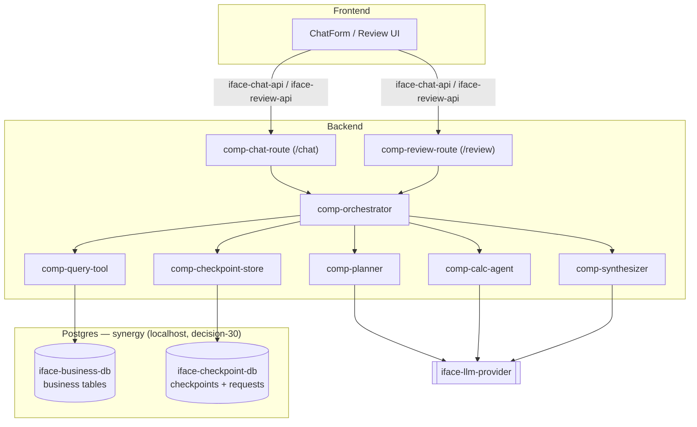
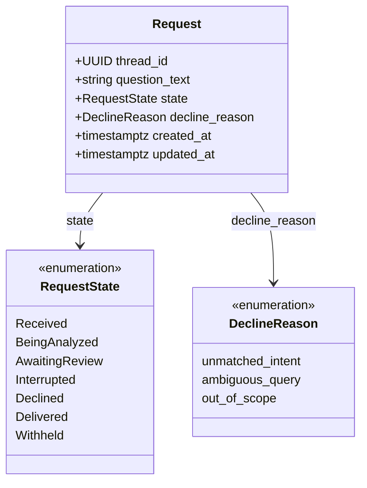
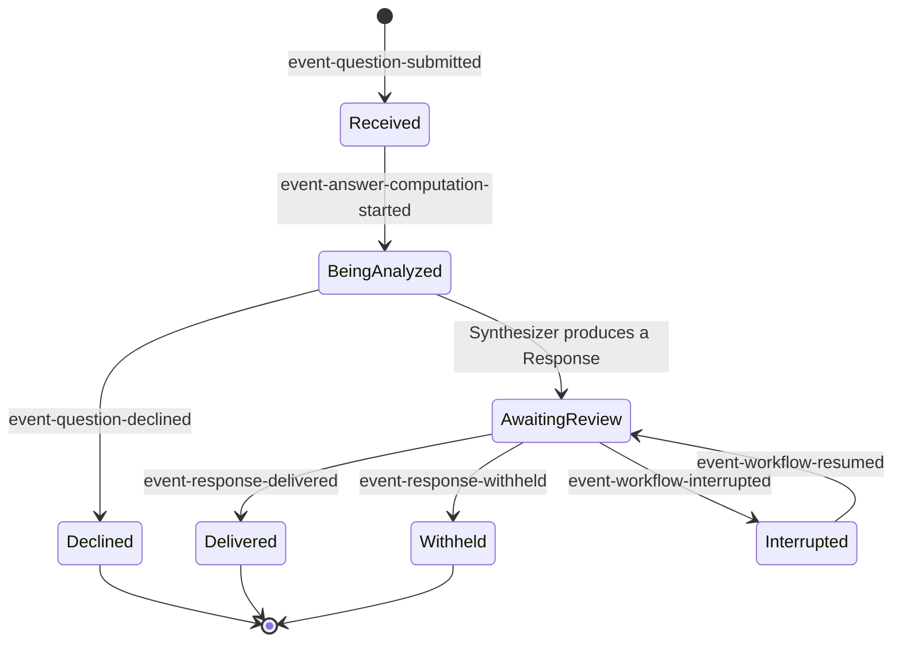
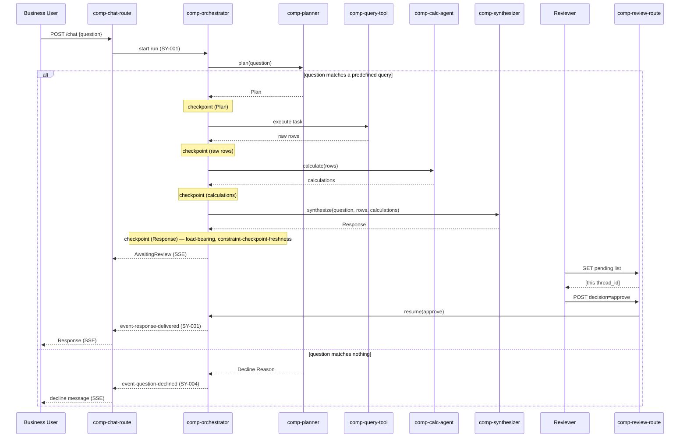

---
daksh:
  type: trd
  subtype: null
  stage: "50a"
  module: ORCHESTRATION
---

# ORCHESTRATION TRD

This is the [TRD](../../glossary#trd) for **ORCHESTRATION** — the concrete
implementation contract behind [`system.md`](system.md) (approved
2026-09-07). It implements all twelve `SY-ORCHESTRATION-NNN` behaviors and
assigns a `TRD-ORCHESTRATION-NNN` requirement to each one technical choice
must satisfy. No Experience Design Spec exists for this module (stage 40
not selected); this TRD rests only on System, Solution, Architecture, the
BRD, and the live repository. The audience is whoever builds this module —
currently the PTL, Vara, alone.

## Scope

This TRD designs: the component/module internal structure, the Postgres
persistence layer (LangGraph's own checkpoint storage, one project-owned
tracking table, and — as of `decision-30` — the business data tables,
all three in one project-owned Postgres instance), the SSE API contracts
for `/chat` and `/review`, and the deployment substrate this module runs
on. It does **not** design: screens or copy (no stage 40 selected), the
business data tables' own column-level schema (project-owned now, but
not yet authored here — see `iface-business-db`'s Open Questions entry),
or the LLM provider's API (external, not owned — `iface-llm-provider`).

## Testable Technical Requirements

Every technical choice above that can fail on its own — independent of
whether the business behavior it supports (`SY-ORCHESTRATION-NNN`) also
passes — gets its own ID here, so Test Specification (50b) has something
concrete to map a `TEST-ORCHESTRATION-NNN` against:

| ID | Requirement | Traces to |
|---|---|---|
| TRD-ORCHESTRATION-001 | `PostgresSaver` writes a new checkpoint after every graph superstep, not just at `AwaitingReview` | decision-23, decision-27 |
| TRD-ORCHESTRATION-002 | A call to `iface-business-db` or `iface-llm-provider` that exceeds 30s raises `event-integration-failure` rather than hanging indefinitely | decision-24 |
| TRD-ORCHESTRATION-003 | `/chat` and `/review` respond with a valid `ag-ui-protocol` SSE event stream, served via `add_langgraph_fastapi_endpoint` | decision-25 |
| TRD-ORCHESTRATION-004 | The `requests` table rejects any row with `decline_reason` set while `state != 'Declined'` | §Data Model (`decline_reason_only_when_declined` constraint) |
| TRD-ORCHESTRATION-005 | The Reviewer's pending-list query is served by `idx_requests_awaiting_review` and returns exactly the rows where `state = 'AwaitingReview'` | §Persistence Constraints |
| TRD-ORCHESTRATION-006 | A second `POST /review/{thread_id}/decision` on an already-resumed thread returns `already_decided`, not a silent no-op or a duplicate effect | §API Contracts |
| TRD-ORCHESTRATION-007 | `comp-calc-agent`'s internal `deepagents` tool calls each produce their own checkpoint under the parent's `PostgresSaver`, distinguishable in checkpoint history | decision-29 |
| TRD-ORCHESTRATION-008 | Business tables and LangGraph's checkpoint tables coexist in the `synergy` Postgres instance with no name collision, and a write to one never touches the other | decision-30 |
| TRD-ORCHESTRATION-009 | Resuming a `Request` after `Interrupted` never re-invokes a `Task` already `COMPLETED` before the interruption | decision-22, decision-23 |
| TRD-ORCHESTRATION-010 | `/chat`, `/review`, and `/review/{thread_id}/decision` all return errors matching the one shared error JSON Schema | §API Contracts |

## Architecture Overview

Every one of System's five internal components (`comp-planner` through
`comp-checkpoint-store`) survives the deletion test unchanged from
Architecture: each is genuinely deep — deleting any one would force every
caller to reimplement real logic (intent-matching, dependency-ordered
execution, predefined-query dispatch, aggregation, response synthesis, or
checkpoint serialization), not just skip a pass-through. Two components
are new at this depth: `comp-chat-route` and `comp-review-route`, the SSE
endpoints that were stub-deleted from the repository (architecture's
revision history) and are designed here for the first time as real seams,
not placeholders.

Four of these six components are LangGraph *nodes* — distinct functions
that each run and produce a result: `comp-planner`, `comp-query-tool`,
`comp-calc-agent`, `comp-synthesizer`. `comp-orchestrator` is not a node;
it *is* the `StateGraph` itself — the edges, conditional routing, and
dependency enforcement (BRD FR-005/FR-008/FR-009) that connects the four
node functions and decides which runs next. `comp-checkpoint-store` is
not a node either — it is the `PostgresSaver` attached to the compiled
graph, invoked automatically after every node completes, not something
that runs as a step in the sequence. The Request Lifecycle state machine
(`§State Machines`) reflects this: it tracks one state for the Request as
a whole, not a separate state per node — every node above runs while the
Request sits in the single `BeingAnalyzed` state.

One of the four node functions is itself a small graph internally:
`comp-calc-agent` is built with `deepagents.create_deep_agent()`
(`decision-29`), which produces its own compiled tool-calling loop (an
LLM step and a tool-execution step, looping until it stops requesting
tools). Registered directly as this node, that inner loop is invisible
to `comp-orchestrator` — it still sees one component that takes rows in
and calculations out, exactly like every other node above.

The single architectural choice that shapes everything else: **LangGraph's
own `PostgresSaver` is the checkpoint mechanism** (`decision-23`), not
hand-rolled persistence. That means this project does not hand-write a
checkpoint table schema at all — `langgraph-checkpoint-postgres` creates
and migrates its own internal tables automatically the first time
`PostgresSaver.setup()` runs; there is no DDL for `checkpoints`,
`checkpoint_blobs`, or `checkpoint_writes` for anyone to author. What this
project *does* own is one thin tracking table, `requests` (`decision-26`),
holding only the business-facing fields the Reviewer's `/review` list
needs to query — `iface-checkpoint-db`'s actual state lives inside
LangGraph's tables, not duplicated here.

As of `decision-30`, the business data this module reads (`iface-business-db`)
is **not** an external, pre-existing system either — it's a Postgres
database the PTL provisions directly (localhost, DB name `synergy` for
this POC), in the **same Postgres instance** as the checkpoint tables and
`requests`. One server, three concerns, each still a distinct logical
seam (different tables, different access pattern: read-only queries
against business tables vs. `PostgresSaver`'s own read/write API against
its tables).

<details><summary>Graph: Where are the seams and the contracts, and what events cross them?</summary>

```items
---
id: orchestration-trd-cognition
title: ORCHESTRATION TRD cognition
default_open_depth: 1
default_color_by: kind
color_palette_source: .daksh/color-palette.json
width: 95vw
---
Components:
  - comp-planner :: Planner Agent | kind: component | summary: "Deletion test: PASS — intent-matching and Plan/Decline generation is real logic, not a pass-through." | spec: [§Data Flow](trd.md#data-flow) | boundary: "backend/app/graph/nodes/planner.py (planned)"
  - comp-orchestrator :: Orchestration Layer | kind: component | summary: "Deletion test: PASS — dependency-ordered execution and the Request Lifecycle transitions live only here." | spec: [§State Machines](trd.md#state-machines) | boundary: "backend/app/graph/graph.py (planned) — the LangGraph StateGraph definition"
  - comp-query-tool :: Query Execution Tool | kind: component | summary: "Deletion test: PASS — one of two distinct dispatch targets the Planner assigns tasks to (two-adapter shape: Query Tool + Calculation Agent behind one executor dispatch)." | spec: [§Data Flow](trd.md#data-flow) | boundary: "backend/app/graph/nodes/query_tool.py (planned)"
  - comp-calc-agent :: Calculation Agent | kind: component | summary: "Deletion test: PASS — the second of the two dispatch targets. Internally a deepagents.create_deep_agent() graph (decision-29), registered directly as this node — still one seam to comp-orchestrator, which has no visibility into the tool-calling loop inside it." | spec: [§Technology Choices](trd.md#technology-choices) | boundary: "backend/app/graph/nodes/calc_agent.py (planned) — wraps a deepagents-built subgraph, not a single model call"
  - comp-synthesizer :: Synthesizer Agent | kind: component | summary: "Deletion test: PASS — mandatory final aggregation step (BRD decision-03), never skippable." | spec: [§Data Flow](trd.md#data-flow) | boundary: "backend/app/graph/nodes/synthesizer.py (planned)"
  - comp-checkpoint-store :: Checkpoint Store (Postgres) | kind: component | summary: "Deletion test: PASS. Deletion test detail: this is a thin wrapper around langgraph-checkpoint-postgres's PostgresSaver (decision-23), not custom persistence code." | spec: [§Persistence Constraints](trd.md#persistence-constraints) | boundary: "backend/app/persistence/checkpointer.py (planned)"
  - comp-chat-route :: Chat Route (/chat) | kind: component | summary: "New at this depth — designed here, not just referenced. SSE endpoint via ag-ui-langgraph's add_langgraph_fastapi_endpoint (decision-25)." | spec: [§API Contracts](trd.md#api-contracts) | boundary: "backend/app/api/routes/chat.py (planned)"
  - comp-review-route :: Review Route (/review) | kind: component | summary: "New at this depth — same SSE pattern as comp-chat-route, separate connection (architecture decision-12)." | spec: [§API Contracts](trd.md#api-contracts) | boundary: "backend/app/api/routes/review.py (planned)"
Logical Interfaces:
  - iface-business-db :: Business Database (read-only) | kind: interface | summary: "Category: remote-but-owned (decision-30) — a Postgres DB the PTL provisions, same instance as iface-checkpoint-db, not an external pre-existing system." | spec: [§Persistence Constraints](trd.md#persistence-constraints) | shape: "read-only SQL, exact table/column schema TBD by predefined-query set (BRD constraint-02) — see Open Questions" | version: "project Postgres instance, same as iface-checkpoint-db" | compatibility: "additive — this project now controls the schema and can evolve it, unlike a true-external system"
  - iface-llm-provider :: LLM Provider | kind: interface | summary: "Category: true-external — Google Gemini, via langchain-google-genai (decision-28)." | spec: [§Technology Choices](trd.md#technology-choices) | shape: "prompt/response per agent, JSON Schema in §API Contracts" | version: "unversioned — third-party service" | compatibility: "breaking — outside this module's control"
  - iface-checkpoint-db :: Checkpoint DB Interface | kind: interface | summary: "Category: remote-but-owned — Postgres we provision, but langgraph-checkpoint-postgres owns the internal schema (decision-23)." | spec: [§Persistence Constraints](trd.md#persistence-constraints) | shape: "langgraph-checkpoint-postgres's own tables (checkpoints, checkpoint_blobs, checkpoint_writes) — not redesigned here" | version: "langgraph-checkpoint-postgres 3.x" | compatibility: "breaking — a major-version bump of the library can change its internal schema; pin the version (§Technology Choices)"
  - iface-chat-api :: Chat AG-UI Channel | kind: interface | summary: "Category: remote-but-owned — this module controls both ends of the contract shape." | spec: [§API Contracts](trd.md#api-contracts) | shape: "POST /chat returns an SSE stream of ag-ui-protocol BaseEvents; JSON Schema in §API Contracts" | version: "v1.0.0" | compatibility: "additive — no consumers exist yet to break"
  - iface-review-api :: Review AG-UI Channel | kind: interface | summary: "Category: remote-but-owned." | spec: [§API Contracts](trd.md#api-contracts) | shape: "POST /review (list pending) and POST /review/{thread_id}/decision, both SSE-capable; JSON Schema in §API Contracts" | version: "v1.0.0" | compatibility: "additive — not yet built"
Events:
  - event-question-submitted :: Question submitted | kind: event | summary: "Reused from System." | spec: [§API Contracts](trd.md#api-contracts) | payload_shape: "RunAgentInput{thread_id, question} — JSON Schema in §API Contracts"
  - event-answer-computation-started :: Analysis started | kind: event | summary: "Reused from System." | spec: [§State Machines](trd.md#state-machines) | payload_shape: "no new fields — state transition only"
  - event-response-delivered :: Response delivered | kind: event | summary: "Reused from System." | spec: [§API Contracts](trd.md#api-contracts) | payload_shape: "AG-UI STATE_DELTA carrying datamodel-response's shape"
  - event-response-withheld :: Response withheld | kind: event | summary: "Reused from System." | spec: [§API Contracts](trd.md#api-contracts) | payload_shape: "AG-UI RUN_FINISHED with no response payload"
  - event-question-declined :: Question declined | kind: event | summary: "Reused from System." | spec: [§API Contracts](trd.md#api-contracts) | payload_shape: "AG-UI STATE_DELTA carrying datamodel-decline-reason's closed category"
  - event-workflow-interrupted :: Workflow interrupted | kind: event | summary: "Reused from System." | spec: [§Persistence Constraints](trd.md#persistence-constraints) | payload_shape: "a LangGraph checkpoint write (via comp-checkpoint-store), not an AG-UI wire event"
  - event-workflow-resumed :: Workflow resumed | kind: event | summary: "Reused from System." | spec: [§State Machines](trd.md#state-machines) | payload_shape: "a LangGraph checkpoint read, restoring full State"
  - event-integration-failure :: External integration failed | kind: event | summary: "Reused from System." | spec: [§Idempotency and Failure Contracts](trd.md#idempotency-and-failure-contracts) | payload_shape: "which interface failed plus the bounded-wait timeout that was exceeded (decision-24)"
Decisions:
  - decision-23 :: LangGraph's own PostgresSaver, not hand-rolled persistence | kind: decision | summary: "The Checkpoint Store wraps langgraph-checkpoint-postgres's PostgresSaver/AsyncPostgresSaver rather than custom Postgres read/write code." | spec: [§Persistence Constraints](trd.md#persistence-constraints) | alternatives: "Hand-rolled persistence (custom tables, custom serialization) was considered and rejected — PostgresSaver is the maintained, idiomatic mechanism for exactly this use case; reimplementing it would duplicate well-tested library code for no benefit." | reversal_trigger: "If langgraph-checkpoint-postgres's schema proves incompatible with a future LangGraph major version and no migration path exists, hand-rolled persistence becomes the fallback."
  - decision-24 :: 30-second bounded wait for external calls | kind: decision | summary: "Both iface-business-db and iface-llm-provider calls are bounded to 30 seconds, satisfying constraint-integration-timeout." | spec: [§Idempotency and Failure Contracts](trd.md#idempotency-and-failure-contracts) | alternatives: "10 seconds was considered and rejected as too tight for LLM calls, which can legitimately take longer than a simple DB query; 30s balances failing fast against not cutting off a slow-but-working LLM response." | reversal_trigger: "If demo-day latency measurement (roadmap step-03a) shows 30s is routinely hit without genuine failure, raise the bound — do not lower it reactively without data."
  - decision-25 :: SSE via ag-ui-langgraph's add_langgraph_fastapi_endpoint | kind: decision | summary: "Both comp-chat-route and comp-review-route are implemented with ag-ui-langgraph's FastAPI helper (architecture decision-13), not a hand-rolled SSE endpoint." | spec: [§API Contracts](trd.md#api-contracts) | alternatives: "A hand-rolled StreamingResponse endpoint was considered and rejected — it would mean re-implementing AG-UI's event serialization and LangGraph state-to-event mapping that add_langgraph_fastapi_endpoint already provides." | reversal_trigger: "If ag-ui-langgraph's helper cannot express the two-route (chat vs review) separation cleanly, fall back to a hand-rolled endpoint for review only."
  - decision-26 :: One thin project-owned `requests` table, LangGraph owns checkpoint internals | kind: decision | summary: "A single requests table (DDL in §Data Model) tracks only the fields the Reviewer's pending-list query needs; it does not duplicate LangGraph's own checkpoint blob storage." | spec: [§Data Model](trd.md#data-model) | alternatives: "Querying LangGraph's internal checkpoint tables directly for the Reviewer's pending list was considered and rejected — those tables are private implementation detail of the checkpointer library, not shaped for business queries, and could change on a LangGraph upgrade (decision-23's reversal_trigger)." | reversal_trigger: "If langgraph-checkpoint-postgres ever exposes an official queryable view matching this need, drop the project-owned table in favor of it."
  - decision-27 :: LangGraph's own checkpoint history satisfies the trace-completeness budget | kind: decision | summary: "constraint-trace-completeness-budget (SY-007) is satisfied by PostgresSaver's built-in per-superstep checkpoint history, not a separate custom audit table." | spec: [§State Machines](trd.md#state-machines) | alternatives: "A dedicated request_transitions audit table (one row per transition) was considered and rejected as redundant — PostgresSaver already persists a new checkpoint at each graph superstep, which is already a full transition history retrievable via get_state_history." | reversal_trigger: "If get_state_history proves too slow or unwieldy for tracing at demo scale, add a lightweight audit table then, not preemptively."
  - decision-28 :: Google Gemini via langchain-google-genai, one provider for all three agents | kind: decision | summary: "comp-planner, comp-calc-agent, and comp-synthesizer all call Google Gemini through langchain-google-genai's ChatGoogleGenerativeAI class — not OpenAI/Anthropic (backend/.env.example's original placeholders), and not the raw google-genai SDK directly." | spec: [§Technology Choices](trd.md#technology-choices) | alternatives: "Raw google-genai SDK calls were considered and rejected — langchain-google-genai integrates directly with LangGraph's existing message types (already a project dependency via langchain-core), so nodes exchange the same message objects throughout instead of converting at the LLM-call boundary. OpenAI and Anthropic were the original .env placeholders from project setup but were never an actual PTL decision; Gemini is the PTL's explicit choice." | reversal_trigger: "If Gemini's tool-calling or structured-output support proves insufficient for the Planner's Plan-schema requirement (FR-004), reassess against langchain-openai/langchain-anthropic then."
  - decision-29 :: Calculation Agent built with deepagents, not a hand-rolled tool loop | kind: decision | summary: "comp-calc-agent's internal tool-calling loop (choosing among sum/average/percentage_change and chaining calls for ratios) is deepagents.create_deep_agent(), registered directly as this node — not a hand-built LangGraph agent+ToolNode subgraph. PTL's explicit choice." | spec: [§Technology Choices](trd.md#technology-choices) | alternatives: "A minimal hand-built StateGraph + ToolNode + tools_condition loop was proposed as a lighter-weight alternative — same tool-calling behavior with no deepagents dependency, since the Calculation Agent's task (pick a known aggregation, chain at most 2-3 calls) doesn't need deepagents' planning/filesystem/sub-agent middleware. Raised for the record; PTL chose deepagents anyway." | reversal_trigger: "If deepagents' unused middleware (filesystem, sub-agents, memory) causes measurable overhead or dependency friction at implementation time, fall back to the hand-built subgraph — functionally equivalent for this node's scope."
  - decision-30 :: Business database is project-owned, same Postgres instance as checkpoints | kind: decision | summary: "iface-business-db is a Postgres database (synergy, localhost) the PTL provisions directly, in the same instance as iface-checkpoint-db and the requests table — not a separate, pre-existing external system this module merely reads from." | spec: [§Persistence Constraints](trd.md#persistence-constraints) | alternatives: "Treating the business database as a genuinely external, not-owned system (the original architecture/solution framing) was the starting assumption — superseded once the PTL confirmed this POC provisions its own Postgres instance for both purposes. One instance, two logical concerns, no separate host to configure." | reversal_trigger: "If this module ever needs to point at a real, pre-existing production business database the team does not control, split it back into a separate instance and restore the true-external categorization — the read/write boundary this decision blurs would need a real read-only DB role at that point, not just query-level discipline."

datamodel-request :: Request | kind: datamodel | summary: "Backed by the project-owned requests table (decision-26) — the only entity with real SQL DDL in this project." | spec: [§Data Model](trd.md#data-model) | shape: "SQL DDL in §Data Model"
datamodel-plan :: Plan | kind: datamodel | summary: "Lives inside the LangGraph State TypedDict, checkpointed automatically by PostgresSaver — not a separate SQL table." | spec: [§Data Model](trd.md#data-model) | shape: "JSON Schema in §Data Model"
datamodel-response :: Synthesized Response | kind: datamodel | summary: "Lives inside the LangGraph State — not a separate SQL table." | spec: [§Data Model](trd.md#data-model) | shape: "JSON Schema in §Data Model"
datamodel-checkpoint :: Checkpoint Record | kind: datamodel | summary: "This is LangGraph's own internal checkpoint representation (decision-23) — this project does not define its shape." | spec: [§Persistence Constraints](trd.md#persistence-constraints) | shape: "owned by langgraph-checkpoint-postgres, not this project"
datamodel-decline-reason :: Decline Reason | kind: datamodel | summary: "A closed enum, stored in the requests table's decline_reason column." | spec: [§Data Model](trd.md#data-model) | shape: "SQL enum, values listed in §Data Model"
statemachine-request :: Request Lifecycle | kind: statemachine | summary: "The authoritative, fully-specified version — extends System's closed state list with side effects and recovery transitions." | spec: [§State Machines](trd.md#state-machines) | entity: "Request (datamodel-request)" | states: "Received, BeingAnalyzed, AwaitingReview, Interrupted, Declined, Delivered, Withheld" | initial_state: "Received" | terminal_states: "Declined, Delivered, Withheld" | transitions: "full guarded table with side effects in §State Machines" | invariants_per_state: "see §State Machines"

edges:
  - comp-orchestrator -produces-> statemachine-request
  - comp-planner -produces-> datamodel-plan
  - comp-planner -produces-> datamodel-decline-reason
  - comp-synthesizer -produces-> datamodel-response
  - comp-checkpoint-store -produces-> iface-checkpoint-db
  - comp-checkpoint-store -produces-> datamodel-checkpoint
  - comp-orchestrator -produces-> datamodel-request
  - comp-chat-route -produces-> iface-chat-api
  - comp-review-route -produces-> iface-review-api
  - iface-business-db -enables-> comp-query-tool
  - iface-llm-provider -enables-> comp-planner
  - iface-llm-provider -enables-> comp-calc-agent
  - iface-llm-provider -enables-> comp-synthesizer
  - iface-chat-api -enables-> comp-orchestrator
  - iface-review-api -enables-> comp-orchestrator
  - comp-orchestrator -produces-> event-question-submitted
  - comp-orchestrator -produces-> event-answer-computation-started
  - comp-orchestrator -produces-> event-response-delivered
  - comp-orchestrator -produces-> event-response-withheld
  - comp-planner -produces-> event-question-declined
  - comp-checkpoint-store -produces-> event-workflow-interrupted
  - comp-checkpoint-store -produces-> event-workflow-resumed
  - comp-orchestrator -produces-> event-integration-failure
  - decision-23 -governs-> comp-checkpoint-store
  - decision-23 -governs-> iface-checkpoint-db
  - decision-24 -governs-> iface-business-db
  - decision-24 -governs-> iface-llm-provider
  - decision-28 -governs-> iface-llm-provider
  - decision-29 -governs-> comp-calc-agent
  - decision-25 -governs-> comp-chat-route
  - decision-25 -governs-> comp-review-route
  - decision-26 -governs-> datamodel-request
  - decision-27 -governs-> statemachine-request
  - decision-30 -governs-> iface-business-db
```

</details>

## Component Diagram



## Data Model

Prose before schema, per rule: this module owns exactly one table. Every
other logical entity from `system.md` (`Plan`, `Synthesized Response`,
`Decline Reason`) lives inside the LangGraph `State` TypedDict, which
`PostgresSaver` checkpoints as an opaque blob — this project does not
design that blob's on-disk format.

```sql
-- requests: the one project-owned table (decision-26)
CREATE TYPE request_state AS ENUM (
    'Received', 'BeingAnalyzed', 'AwaitingReview',
    'Interrupted', 'Declined', 'Delivered', 'Withheld'
);

CREATE TYPE decline_reason AS ENUM (
    'unmatched_intent', 'ambiguous_query', 'out_of_scope'
);

CREATE TABLE requests (
    thread_id    UUID PRIMARY KEY,
    question_text TEXT NOT NULL,
    state        request_state NOT NULL DEFAULT 'Received',
    decline_reason decline_reason NULL,
    created_at   TIMESTAMPTZ NOT NULL DEFAULT now(),
    updated_at   TIMESTAMPTZ NOT NULL DEFAULT now(),

    CONSTRAINT decline_reason_only_when_declined
        CHECK (decline_reason IS NULL OR state = 'Declined')
);

CREATE INDEX idx_requests_awaiting_review
    ON requests (state)
    WHERE state = 'AwaitingReview';
```



`Plan`, `Synthesized Response`, and the full checkpoint payload are
JSON-shaped fields inside the LangGraph `State` (not this table):

```json
{
  "question": "string",
  "plan": {
    "tasks": [
      {"id": "string", "description": "string", "executor": "query_execution_tool | calculation_agent", "depends_on": ["string"], "status": "PENDING | RUNNING | COMPLETED | FAILED"}
    ]
  },
  "raw_rows": "array | null",
  "calculations": "object | null",
  "synthesized_response": "string | null",
  "human_approval": "pending | approved | rejected | null"
}
```

## Persistence Constraints

For the one entity this project owns (`requests`):

- **Primary key.** `thread_id` (UUID), the same identifier LangGraph uses
  to key its own checkpoints — one join key across both storage
  mechanisms, never two.
- **Uniqueness.** `thread_id` alone; no composite uniqueness needed.
- **Foreign keys.** None — `requests` does not reference LangGraph's
  internal tables (decision-26's whole point is not coupling to their
  schema); the link is the shared `thread_id` value, not a DB-level FK.
- **Indexes.** `idx_requests_awaiting_review`, a partial index on
  `state = 'AwaitingReview'` — serves exactly the Reviewer's pending-list
  query (`iface-review-api`) and nothing else; no other access pattern is
  defined yet.
- **Retention.** Undecided (system.md's open question, unchanged here) —
  no row is deleted or archived by this design. Left open for TRD-time
  follow-up, not invented here.
- **Migration policy.** Additive-only for this table (new nullable
  columns only); `request_state`/`decline_reason` enum values are
  additive-only too — removing a value requires a data migration first.
- **Dedupe keys.** Not applicable — `requests` has no external-source
  ingestion; every row originates from this module's own
  `event-question-submitted`.

For `iface-checkpoint-db`'s own tables (`checkpoints`, `checkpoint_blobs`,
`checkpoint_writes`): owned and migrated by `langgraph-checkpoint-postgres`
(decision-23). Nobody hand-writes DDL for these — calling
`PostgresSaver.setup()` once (e.g. at app startup, or as a one-off script)
creates them automatically if they don't already exist. This project runs
that setup call but does not author or alter that schema directly.

For `iface-business-db` (decision-30): same Postgres instance
(`synergy`, localhost), different tables. **Contract-hardened
2026-09-08** (`TASK-ORCHESTRATION-021`) — the assumed
sales/order/customer/product shape this TRD originally named was never
built; the real business data already seeded into `synergy` is a single
clinic-appointments table, `appointments` (27,560 real rows,
"Synergy Healthcare & Wellness" — a live PTL-provisioned dataset, not
synthetic, per vision.md decision-09). One table, not four — this POC's
business domain is appointment scheduling and billing, not retail
sales; every earlier reference in this TRD to sales/order/customer/product
is superseded by this section, not still-current elsewhere.

- **Primary key.** `appt_id` (bigint) — already enforced by the seeded
  table (`appointments_pkey`).
- **Uniqueness.** `appt_id` alone.
- **Foreign keys.** None — `appointments` is a single flat table (no
  separate patient/doctor/clinic tables to reference); a real production
  schema would likely normalize these, but that's out of scope for this
  POC's read-only query layer.
- **Indexes.** Three, one per predefined query below: `idx_appointments_appt_date`
  (serves `appointment_count_by_month`), `idx_appointments_clinic_name`
  (serves `revenue_by_clinic`), `idx_appointments_status` (serves
  `cancellation_rate`) — same one-index-per-real-access-pattern
  discipline as `idx_requests_awaiting_review`, though at 27.5k rows none
  is performance-critical yet; documented for contract discipline, not
  because a sequential scan is currently slow.
- **Retention.** Undecided — no row is deleted or archived by this
  design, same as `requests`. Left open, not invented here.
- **Migration policy.** Unlike `requests`, this table's DDL was not
  authored via this project's own migration tooling — it was seeded
  directly into `synergy` before this TRD section existed. This TRD
  treats its current shape as frozen or additive-only going forward
  (new nullable columns only); no destructive change is designed here.
- **Dedupe keys.** Not applicable — this project only reads `appointments`,
  it does not ingest into it.
- **Known data quality issue.** `clinic_name` has five clinics, each
  stored under two inconsistent spellings (`"...Adyar"` vs
  `"..., Adyar"` — a stray comma, nothing more exotic). The predefined
  queries normalize this at query time (`replace(clinic_name, ', ', ' ')`),
  not via a data migration — cheaper and reversible if the real
  provenance of the inconsistency turns out to matter later.

**Predefined-query set (constraint-02)** — the fixed 3-4 queries
`comp-query-tool` dispatches (`TASK-ORCHESTRATION-023` writes the actual
SQL; named here per this task's own acceptance criterion):

1. `appointment_count_by_month` — appointment counts grouped by month.
2. `overall_revenue` — total and average `paid_amount` across all appointments.
3. `revenue_by_clinic` — total and average `paid_amount` grouped by (normalized) clinic.
4. `cancellation_rate` — appointment counts grouped by `status` (`CNF`/`PCANCEL`/`NOSHOW`/`DCANCEL`).

Whatever connection this module uses to query `appointments` should be
read-only in practice (`constraint-01`), even though, unlike a
true-external system, the same Postgres instance also holds tables this
module writes to (`checkpoints`, `requests`) — that read/write split is
enforced by which queries the code issues, not by two different
database servers.

`comp-calc-agent`'s internal `deepagents` graph (decision-29) is compiled
with **no checkpointer of its own** — it must not be given a separate
`PostgresSaver` instance, which would create a second checkpoint document
and cause resume problems. Because it is registered directly as a node in
the parent graph, its checkpoint writes flow through the same
`PostgresSaver` as everything else, distinguished only by an internal
checkpoint namespace — one checkpoint store for the whole module, not two.

## State Machines

The Request Lifecycle, now with every side effect and recovery path named
(extends `system.md`'s version, same state vocabulary — no renaming):



| From | To | Trigger / Guard | Side effects |
|---|---|---|---|
| — | `Received` | `POST /chat` with a question | `requests` row inserted; LangGraph run started with a fresh `thread_id` |
| `Received` | `BeingAnalyzed` | Planner node begins | `requests.state` updated; no external call yet |
| `BeingAnalyzed` | `AwaitingReview` | Synthesizer node completes | `requests.state` updated; a LangGraph checkpoint is written (`decision-27`'s audit point) |
| `BeingAnalyzed` | `Declined` | Planner's intent-match fails (constraint-02) | `requests.state` and `decline_reason` updated; no Plan is ever created (`invariant-decline-no-plan`) |
| `AwaitingReview` | `Delivered` | `POST /review/{thread_id}/decision` with `approve` | `requests.state` updated; response streamed to `/chat`'s SSE connection |
| `AwaitingReview` | `Withheld` | `POST /review/{thread_id}/decision` with `reject` | `requests.state` updated; no further event on `/chat` |
| `AwaitingReview` | `Interrupted` | Process restart/crash while a checkpoint already exists (`constraint-checkpoint-freshness`) | No new side effect — this is the *absence* of an expected event, detected on restart, not an event this module emits itself |
| `Interrupted` | `AwaitingReview` | `PostgresSaver.get_tuple(thread_id)` returns a valid checkpoint on restart | State restored from the checkpoint blob; `requests.state` re-confirmed as `AwaitingReview` (it never left, in the DB's view — see invariants below) |

**Invariants per state** (unchanged from `system.md`, restated with the
mechanism that enforces each):

| State | Invariant | Enforced by |
|---|---|---|
| `Received` | No Plan, Response, or Checkpoint exists | Fresh `thread_id`; nothing to load |
| `BeingAnalyzed` | At most one active Plan | LangGraph's own single-run-per-thread model |
| `AwaitingReview` | Exactly one Response exists; a checkpoint exists | `constraint-checkpoint-freshness` — the checkpoint write happens in the same graph step that produces the Response, before the node returns |
| `Interrupted` | A checkpoint sufficient to restore `AwaitingReview` exists | `PostgresSaver` writes atomically per superstep — there is no partial-write state to recover from |
| `Declined` / `Delivered` / `Withheld` | Terminal — no further transition | No code path re-invokes a completed `thread_id`; `constraint-no-silent-retry` is enforced by never calling the graph again for that ID |

**Recovery transitions:** the only recovery edge is `Interrupted →
AwaitingReview`, triggered automatically on the next read of that
`thread_id` (no manual operator action, no cost beyond one Postgres read).
There is no recovery transition out of `Received` or `BeingAnalyzed`
because `constraint-checkpoint-freshness` guarantees no interruption can
be observed before `AwaitingReview` — if the process dies earlier, the
`requests` row exists but is simply resubmitted by the Business User as a
fresh run (matching decision-19's "no automatic retry" philosophy applied
uniformly).

## API Contracts

Both endpoints follow the pattern AG-UI's reference `HttpAgent` expects
(verified against `docs.ag-ui.com`, 2026-09-07): a `POST` carrying
`RunAgentInput`, whose response is an SSE stream of `BaseEvent` objects —
not two separate calls.

**`POST /chat` — `iface-chat-api` v1.0.0**

Request (JSON Schema):
```json
{
  "type": "object",
  "required": ["thread_id", "question"],
  "properties": {
    "thread_id": {"type": "string", "format": "uuid"},
    "question": {"type": "string", "minLength": 1}
  }
}
```
Response: `text/event-stream` — a sequence of `ag-ui-protocol` `BaseEvent`
objects (`RUN_STARTED`, `STATE_DELTA` carrying `datamodel-response` once
`Delivered`, `RUN_FINISHED`). Producer: `comp-chat-route`. Consumer:
`comp-chatform` (frontend).

**`POST /review` — `iface-review-api` v1.0.0 (list pending)**

Response (JSON Schema, not a stream — a plain snapshot list):
```json
{
  "type": "array",
  "items": {
    "type": "object",
    "properties": {
      "thread_id": {"type": "string", "format": "uuid"},
      "question_text": {"type": "string"},
      "updated_at": {"type": "string", "format": "date-time"}
    }
  }
}
```
Backed directly by `idx_requests_awaiting_review`.

**`POST /review/{thread_id}/decision` — `iface-review-api` v1.0.0 (act)**

Request:
```json
{
  "type": "object",
  "required": ["decision"],
  "properties": {
    "decision": {"type": "string", "enum": ["approve", "reject"]}
  }
}
```
Response: SSE stream, same `BaseEvent` shape as `/chat`, carrying
`event-response-delivered` or `event-response-withheld`.

**Error shape (all three endpoints):**
```json
{
  "type": "object",
  "properties": {
    "code": {"type": "string", "enum": ["not_found", "already_decided", "integration_timeout", "internal_error"]},
    "message": {"type": "string"},
    "retryable": {"type": "boolean"},
    "user_facing_copy_key": {"type": "string"}
  }
}
```
`already_decided` covers BRD decision-08's first-write-wins case: a second
`/review/{thread_id}/decision` call after the thread already resumed gets
this error, not a silent no-op — a deliberate tightening beyond what the
BRD required, worth flagging to the PTL as a small scope addition.

## Idempotency and Failure Contracts

ORCHESTRATION handles distributed state (checkpointed, resumable
execution) even though it handles no money and no external webhooks — the
recovery path still needs an explicit contract:

- **Idempotency keys.** `thread_id` is the idempotency key for the entire
  run — `POST /chat` with an already-used `thread_id` resumes rather than
  starts fresh (LangGraph's own thread semantics).
- **Retry semantics.** `iface-business-db` and `iface-llm-provider` calls
  are retried zero times by this module — `decision-24`'s 30-second bound
  is a *timeout*, not a retry budget. A timeout raises
  `event-integration-failure` and fails only that Request
  (`requirement-07`), never retried automatically (`constraint-no-silent-retry`,
  applied here too).
- **Duplicate callback handling.** Not applicable — this module has no
  inbound webhooks.
- **Delivery guarantee.** At-least-once for the checkpoint write
  (`PostgresSaver`'s own guarantee); exactly-once for the Business User
  actually seeing a Response, enforced by `invariant-response-immutable`
  plus the terminal-state invariants above — even if a checkpoint is
  somehow written twice, `Delivered` is only ever reached once per
  `thread_id`.
- **Failure response replay.** A `/review/{thread_id}/decision` retry
  after the thread already resumed gets `already_decided` (see API
  Contracts), never a silent replay of the original success.

## Data Flow

`PostgresSaver` checkpoints automatically after every step below — Plan,
raw rows, calculations, and the Response each get their own checkpoint the
moment that step completes (`decision-27`'s per-superstep history, not a
one-time write); the diagram marks each one. Only the last of these is
load-bearing: `constraint-checkpoint-freshness` requires a checkpoint to
exist before `AwaitingReview` begins, because that is the exact window
BRD `flow-03` needs to recover from. The earlier ones matter for tracing
(`SY-007`), not for gating the resume path.



## Technology Choices

Conforms to Technology Baseline: Python 3.11+, FastAPI ≥0.141.1, LangGraph
≥1.2.11, `uv` (`docs/system-architecture.md` §Technology Baseline). This
TRD adds the following module-discretionary dependencies, none of which
deviate from a fixed baseline item:

| Choice | Package | Why |
|---|---|---|
| Checkpoint persistence | `langgraph-checkpoint-postgres` (pin exact version at implementation time — 3.1.2 was latest as of 2026-09-07) | decision-23 — official, maintained checkpointer; avoids reimplementing serialization/migration |
| Postgres driver | `psycopg` (v3, per `langgraph-checkpoint-postgres`'s own requirement — not `psycopg2`) | Required transitively; no independent choice to make |
| AG-UI backend SDK | `ag-ui-langgraph` (needs `langchain>=1.2.0`, not yet a project dependency — add it) | decision-25, verified 2026-09-07 against PyPI metadata |
| AG-UI frontend SDK | `@ag-ui/client` | decision-25 |
| LLM client | `langchain-google-genai` (4.4.0 latest as of 2026-09-07; needs `langchain-core>=1.6.1,<2.0.0` — this project's `>=1.6.2` pin satisfies it) | decision-28 — Google Gemini via LangChain's `ChatGoogleGenerativeAI`, replaces the OpenAI/Anthropic placeholders from project setup |
| Calculation Agent's tool-calling loop | `deepagents` (0.4.11 latest as of 2026-09-07; needs `langchain>=1.3.18` — tighter than ag-ui-langgraph's own `>=1.2.0` floor, so `>=1.3.18` becomes the effective project floor once both are installed; `langchain-google-genai>=4.3.7` — this project's 4.4.0 satisfies it) | decision-29 — `comp-calc-agent` is a `deepagents.create_deep_agent()` graph, registered directly as the node (not wrapped in a manual `.invoke()` call) so it shares the parent's `PostgresSaver` checkpointer and its internal tool calls are individually checkpointed, per §Persistence Constraints |

## Security Design

No authentication or authorization (BRD constraint-03, architecture
constraint-security) — unchanged by this TRD. The `already_decided` error
code (§API Contracts) is the closest thing to an authorization check this
module performs, and it is a state check, not an identity check. Data
protection: `iface-business-db` access should be read-only in practice
(constraint-01) — but since decision-30 puts it in the same Postgres
instance this module also writes to (checkpoints, `requests`), that
read-only boundary is enforced by which queries the application code
issues, not by a separate database or a read-only DB role (neither is
designed here; a real deployment would want a read-only Postgres role
scoped to the business tables, not the shared superuser connection this
POC assumes). Audit trail: the
`requests` table's `updated_at` plus LangGraph's own checkpoint history
(`decision-27`) together cover every state transition.

## NFR Design

| NFR (from BRD/Architecture) | How this design satisfies it |
|---|---|
| Performance (no numeric SLA) | `decision-24`'s 30s bound keeps a hung external call from stalling a Request indefinitely; no further tuning designed for a POC |
| Reliability (graceful failure handling) | `event-integration-failure` isolates one Request's failure (`requirement-07`); `constraint-no-silent-retry` prevents cascading retries |
| Observability (100% trace) | `decision-27` — LangGraph's checkpoint history is the trace; `requests.updated_at` gives a business-level summary view |
| Security (POC-appropriate, no hardening) | Unchanged — see §Security Design |

## Deployment & Operations

- **Environment.** Deploys to `env-local-dev` only (architecture
  decision-11 — no staging or production environment exists).
- **Infrastructure.** Runs on `infra-uvicorn` (backend process) and
  `infra-postgres-container` — `requests`, LangGraph's own checkpoint
  tables, *and* the business data tables all live in one Postgres
  instance (localhost, DB name `synergy` for this POC — architecture
  decision-10, extended by decision-30). The frontend runs on
  `infra-vite`, unaffected by this TRD.
- **Pipeline.** None — architecture decision-11 means no CI/CD pipeline
  exists for this module. Not raised as a roadmap change; the POC's build
  order (roadmap decision-14) does not require one.
- **Runtime invariants.** `invariant-single-checkpoint-per-request`,
  `invariant-decline-no-plan`, `invariant-response-immutable`,
  `invariant-task-status-closed` (all from `system.md`) apply unchanged
  at runtime.
- **Failure modes.** `event-integration-failure` (phase: runtime) is the
  one module-specific runtime risk this TRD names — mitigated by
  `decision-24`'s bounded wait, not auto-recovered (no retry).
- **Configuration surface.** `DATABASE_URL`/`POSTGRES_*` (pointing at the
  `synergy` database, decision-30) and `GOOGLE_API_KEY` (decision-28 —
  replaces the original OpenAI/Anthropic placeholders), all in
  `backend/.env` (gitignored, `invariant-config` from architecture). One
  connection string serves business-table reads, checkpoint reads/writes,
  and `requests` reads/writes alike — there is no second `.env` variable
  for a separate business-DB host. No feature flags exist.
- **Rollback story.** No migration exists yet to roll back — the
  `requests` table is new. Once created, dropping it is safe in isolation
  (no other table references it — no foreign keys, per §Persistence
  Constraints) but destroys the Reviewer's pending-list history; LangGraph's
  own tables are unaffected by rolling back this module's migration.
- **Observability hooks.** LangGraph's checkpoint history (`decision-27`)
  plus whatever FastAPI/uvicorn request logging exists by default — no
  additional metrics or traces designed here for a POC. Deep runbook
  detail (on-call, dashboards) is Handbook (90) work, not TRD work.

## Open Questions

- **`requests` retention policy** — carried over from `system.md`,
  unchanged: no deletion/archival designed. `[open]`
- **Decline Reason category set** — `unmatched_intent`,
  `ambiguous_query`, `out_of_scope` are a reasonable starting closed set,
  but the Planner's actual intent-matching logic (not yet built) may
  reveal a different natural set. Revisit once `comp-planner` exists.
  `[open]`
- **`already_decided` scope addition** — this TRD adds an explicit error
  response for a second decision on an already-resumed thread; the BRD
  only specified first-write-wins as a silent no-op (decision-08). Flagging
  for PTL confirmation that an explicit error is preferred over the BRD's
  original silent framing — not a blocker, but worth a conscious yes.
  `[open]`
- **Business data table schema** — resolved 2026-09-08
  (`TASK-ORCHESTRATION-021`, see §Persistence Constraints): the real
  seeded table is `appointments` (clinic scheduling/billing), not the
  sales/order/customer/product shape originally assumed here — the
  domain itself was wrong, not just the DDL. `[resolved]`

## Approval

Approved by: Vara
Role:        PTL
Date:        2026-09-08
Hash:        7b4cfe770a62…
